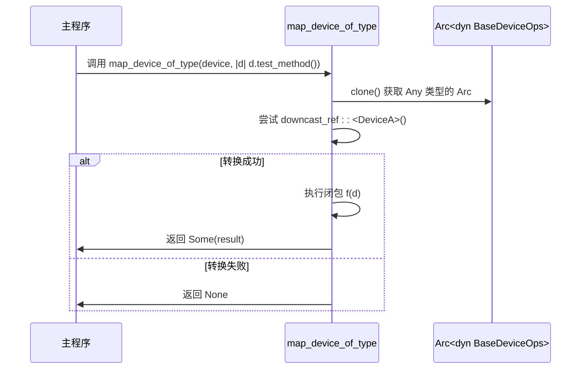

# 快速开始

<cite>
**本文档中引用的文件**
- [Cargo.toml](file://Cargo.toml)
- [src/lib.rs](file://src/lib.rs)
- [src/test.rs](file://src/test.rs)
- [README.md](file://README.md)
</cite>

## 目录
1. [简介](#简介)
2. [环境准备与依赖配置](#环境准备与依赖配置)
3. [定义虚拟设备结构体](#定义虚拟设备结构体)
4. [实现BaseDeviceOps trait](#实现basedeviceops-trait)
5. [创建设备配置实例](#创建设备配置实例)
6. [验证类型转换功能](#验证类型转换功能)
7. [常见构建错误与解决方案](#常见构建错误与解决方案)
8. [推荐开发工具链](#推荐开发工具链)

## 简介
本指南旨在帮助开发者快速上手 `axdevice_base` 库，用于在 ArceOS 超级管理程序（hypervisor）环境中开发和集成虚拟设备。通过本教程，您将学习如何设置开发环境、定义一个简单的虚拟设备、实现核心操作接口，并验证关键功能。所有示例均基于库中提供的实际代码模式。

## 环境准备与依赖配置

在开始之前，您需要确保您的 Rust 开发环境已正确安装。`axdevice_base` 是一个为 `no_std` 环境设计的库，因此它不依赖于标准库。

要将 `axdevice_base` 添加到您的项目中，请在 `Cargo.toml` 文件的 `[dependencies]` 部分添加以下内容：

```toml
[dependencies]
axdevice_base = { path = "d:\\project\\qcoder\\axdevice_base" }
```

该库依赖于 ArceOS 项目的一系列 crate，如 `axerrno`, `axaddrspace`, 和 `axvmconfig`。这些依赖已在 `axdevice_base` 的 `Cargo.toml` 中声明，版本号为 `0.1.0`，确保了版本兼容性。同时，该库启用了 `serde` 的 `derive` 和 `alloc` 特性以支持序列化和堆内存分配。

**Section sources**
- [Cargo.toml](file://Cargo.toml#L10-L18)

## 定义虚拟设备结构体

第一步是定义一个表示您虚拟设备的 Rust 结构体。这个结构体将包含设备的所有状态信息。在下面的例子中，我们定义了一个名为 `MyDevice` 的简单设备，目前它不包含任何特定的状态字段。

```rust
struct MyDevice;
```

这是一个最简化的形式。在实际应用中，您可以在此结构体中添加字段来存储设备寄存器、缓冲区或其他运行时数据。

**Section sources**
- [src/test.rs](file://src/test.rs#L9)

## 实现BaseDeviceOps trait

所有虚拟设备都必须实现 `BaseDeviceOps` trait。这是一个核心接口，定义了设备的基本行为。您需要为您的设备结构体提供此 trait 的具体实现。

```rust
impl BaseDeviceOps<GuestPhysAddrRange> for MyDevice {
    fn emu_type(&self) -> EmuDeviceType {
        EmuDeviceType::Dummy
    }

    fn address_range(&self) -> GuestPhysAddrRange {
        (0x1000..0x2000).try_into().unwrap()
    }

    fn handle_read(&self, addr: GuestPhysAddr, _width: AccessWidth) -> AxResult<usize> {
        Ok(addr.as_usize())
    }

    fn handle_write(&self, _addr: GuestPhysAddr, _width: AccessWidth, _val: usize) -> AxResult {
        Ok(())
    }
}
```

### 关键语法点解释：
- **泛型参数 `<GuestPhysAddrRange>`**: 指定此设备是一个 MMIO 设备，其地址范围由 `GuestPhysAddrRange` 表示。
- **`emu_type` 方法**: 返回设备的类型枚举值。在此示例中使用了 `EmuDeviceType::Dummy`。
- **`address_range` 方法**: 定义设备在客户机物理地址空间中的映射范围，此处为 `0x1000` 到 `0x2000`。
- **`handle_read` 和 `handle_write` 方法**: 处理对设备的读写访问。`handle_read` 返回被读取的地址值，`handle_write` 接受写入的值但不执行任何操作。

**Section sources**
- [src/lib.rs](file://src/lib.rs#L55-L67)
- [src/test.rs](file://src/test.rs#L11-L31)

## 创建设备配置实例

`EmulatedDeviceConfig` 结构体用于在虚拟机启动时配置设备。您可以使用其默认构造函数并根据需要修改字段。

```rust
let config = EmulatedDeviceConfig {
    name: "my_device".to_string(),
    base_ipa: 0x1000,
    length: 0x1000,
    irq_id: 5,
    emu_type: EmuDeviceType::Dummy as usize,
    cfg_list: vec![],
};
```

此配置指定了设备名称、基地址、长度、中断请求 ID 和设备类型等信息。

**Section sources**
- [src/lib.rs](file://src/lib.rs#L40-L53)

## 验证类型转换功能

`map_device_of_type` 函数允许您安全地检查一个 `Arc<dyn BaseDeviceOps>` 是否指向特定类型的设备（例如 `MyDevice`），并在确认后调用该类型特有的方法。

```rust
// 假设 devices 是一个包含各种设备的向量
for device in &devices {
    if let Some(my_device) = map_device_of_type::<MyDevice, _, _, _>(device, |d| d) {
        // 此处可以安全地调用 MyDevice 的特有方法
        my_device.test_method();
    }
}
```

在 `src/test.rs` 中有一个完整的测试用例，展示了如何使用 `map_device_of_type` 来识别 `DeviceA` 并调用其独有的 `test_method()` 方法。



**Diagram sources**
- [src/lib.rs](file://src/lib.rs#L69-L83)
- [src/test.rs](file://src/test.rs#L45-L74)

**Section sources**
- [src/lib.rs](file://src/lib.rs#L69-L83)
- [src/test.rs](file://src/test.rs#L45-L74)

## 常见构建错误与解决方案

在集成 `axdevice_base` 时，可能会遇到以下常见错误：

1.  **缺少 feature gate 错误**:
    *   **错误信息**: `error[E0658]: the `#![feature(...)]` attribute is an experimental feature`
    *   **原因**: `axdevice_base` 使用了 `#![feature(trait_alias)]`, `#![feature(trait_upcasting)]`, 和 `#![feature(generic_const_exprs)]` 这些不稳定特性。
    *   **解决方案**: 确保您的项目也启用了这些特性。在您的 `lib.rs` 或 `main.rs` 的顶部添加 `#![feature(trait_alias, trait_upcasting, generic_const_exprs)]`。

2.  **链接或未解析的符号错误**:
    *   **错误信息**: `undefined reference to ...` 或 `linking with 'cc' failed`
    *   **原因**: 通常是因为 `no_std` 环境下缺少必要的运行时或内存分配器。
    *   **解决方案**: 确保您的二进制项目（bin crate）正确链接了 `std` 或实现了 `panic_handler`、`oom` 等必需的 `no_std` 组件，并且正确配置了全局分配器（如 `global_allocator`）。

3.  **版本冲突**:
    *   **错误信息**: `failed to select a version for `axaddrspace``
    *   **原因**: 项目中其他依赖项要求的 ArceOS crate 版本与 `axdevice_base` 不兼容。
    *   **解决方案**: 检查 `axdevice_base/Cargo.toml` 中声明的版本（如 `axaddrspace = "0.1.0"`），并确保您的工作区中所有相关 crate 都使用相同版本，或使用 Cargo 的 `[patch]` 功能进行版本统一。

## 推荐开发工具链

为了获得最佳的开发体验，建议使用以下工具链：

- **Rust 工具链**: 使用最新的稳定版 Rust 编译器（`rustc`）。由于库使用了不稳定特性，可能需要 nightly 版本，但请参考官方文档确认最低支持版本。
- **IDE 支持**: 推荐使用 Visual Studio Code 配合 `rust-analyzer` 插件。确保 `rust-analyzer` 配置为使用正确的 Rust toolchain（nightly 或 stable）。
- **测试环境**: 使用 `qemu-system-aarch64` 来模拟 AArch64 架构，这是 ArceOS 的主要目标平台。配置 QEMU 启动脚本以加载您的内核镜像并传递必要的设备树或 ACPI 表。
- **调试工具**: 结合 `gdb` 和 QEMU 的远程调试功能，可以在源码级别调试虚拟设备的执行流程。

遵循本指南，您应该能够成功搭建开发环境并完成第一个基于 `axdevice_base` 的虚拟设备集成。