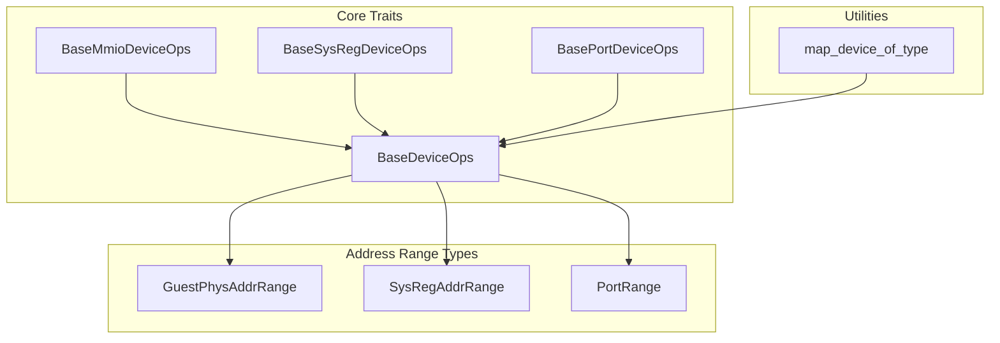
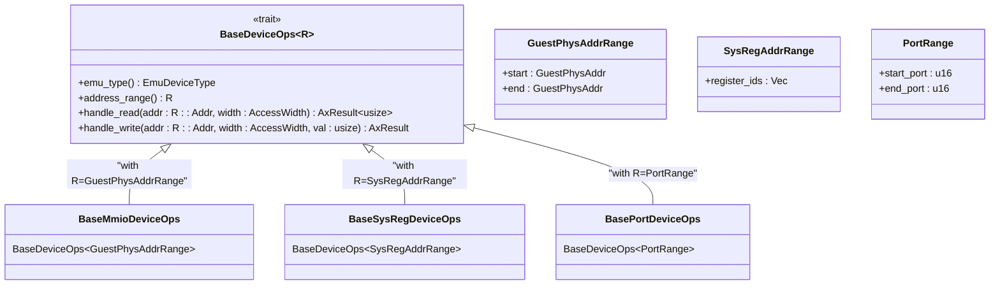
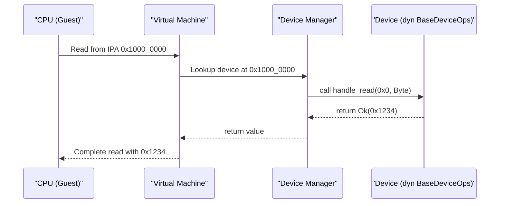
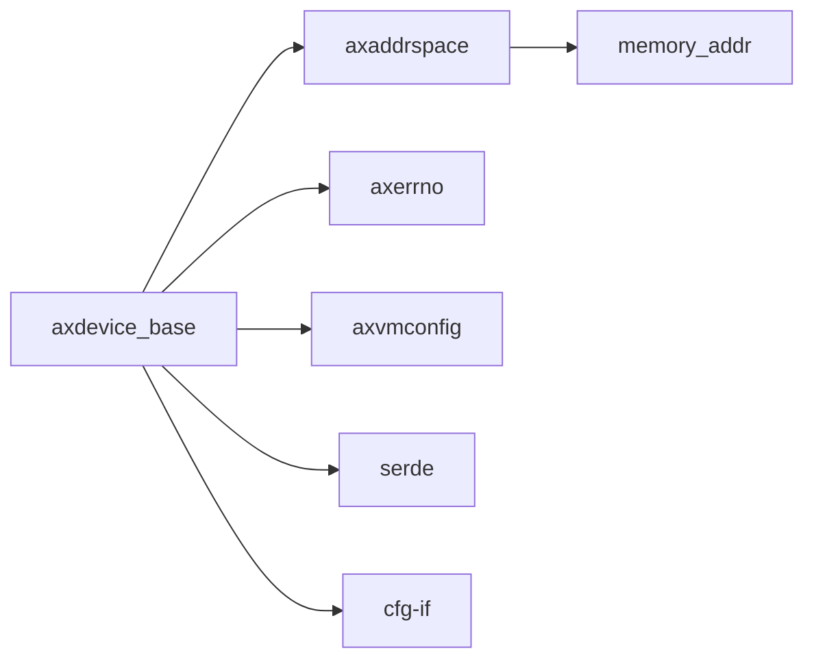

# BaseDeviceOps Trait 详解

<cite>
**Referenced Files in This Document**   
- [lib.rs](file://src/lib.rs)
- [test.rs](file://src/test.rs)
- [Cargo.toml](file://Cargo.toml)
- [README.md](file://README.md)
</cite>

## 目录
1. [引言](#引言)
2. [项目结构](#项目结构)
3. [核心组件](#核心组件)
4. [架构概述](#架构概述)
5. [详细组件分析](#详细组件分析)
6. [依赖关系分析](#依赖关系分析)
7. [性能考量](#性能考量)
8. [故障排查指南](#故障排查指南)
9. [结论](#结论)

## 引言

`BaseDeviceOps` 是 ArceOS 虚拟化平台中所有模拟设备必须实现的核心接口。该 trait 定义了虚拟设备在运行时所需的基本行为，包括类型识别、地址空间管理以及对读写操作的处理能力。本文档深入解析 `BaseDeviceOps` 的设计原理与工程实践，旨在为开发者提供清晰的实现指导和调试策略。

## 项目结构

本项目采用典型的 Rust 库结构，包含源码、测试模块及配置文件：

```
.
├── src
│   ├── lib.rs          # 核心 trait 和数据结构定义
│   └── test.rs         # 单元测试示例
├── Cargo.toml          # 构建与依赖配置
└── README.md           # 项目说明文档
```

**Section sources**
- [lib.rs](file://src/lib.rs#L1-L83)
- [test.rs](file://src/test.rs#L1-L75)
- [Cargo.toml](file://Cargo.toml#L1-L18)
- [README.md](file://README.md#L1-L45)

## 核心组件

`BaseDeviceOps` trait 是整个虚拟设备系统的基础抽象，其设计目标是统一不同类型的设备（如 MMIO、端口、系统寄存器）的操作接口。通过泛型参数 `R: DeviceAddrRange`，该 trait 支持多种地址空间模型，确保类型安全的同时保持灵活性。

此外，`EmulatedDeviceConfig` 结构体用于描述设备的初始化配置信息，包括名称、基地址、长度、中断号等元数据，便于设备注册与管理。

**Section sources**
- [lib.rs](file://src/lib.rs#L50-L83)
- [lib.rs](file://src/lib.rs#L30-L48)

## 架构概述



**Diagram sources**
- [lib.rs](file://src/lib.rs#L50-L83)

## 详细组件分析

### BaseDeviceOps 接口语义分析

`BaseDeviceOps` 定义了四个关键方法，分别承担不同的职责：

#### 方法语义与调用时机

| 方法名 | 参数含义 | 返回值类型 | 调用时机 |
|-------|--------|-----------|---------|
| `emu_type` | 无参数 | `EmuDeviceType` | 设备注册或类型查询时调用，用于识别设备种类 |
| `address_range` | 无参数 | `R`（泛型地址范围） | 设备插入地址空间映射表时调用，确定其可访问的内存区域 |
| `handle_read` | `addr`: 访问偏移地址<br>`width`: 访问宽度（字节/半字/字等） | `AxResult<usize>` | 当客户机尝试从设备映射区域读取数据时触发 |
| `handle_write` | `addr`: 访问偏移地址<br>`width`: 访问宽度<br>`val`: 写入值 | `AxResult` | 当客户机向设备映射区域写入数据时触发 |

这些方法共同构成了设备对外暴露的行为契约，任何实现该 trait 的设备都必须正确响应这些操作。

**Section sources**
- [lib.rs](file://src/lib.rs#L50-L65)

#### 关联类型 R: DeviceAddrRange 的作用机制

`BaseDeviceOps` 使用泛型参数 `R` 来约束设备所使用的地址空间模型。通过这种方式，编译器可以在编译期确保不同类型设备使用正确的地址范围类型：

- `GuestPhysAddrRange`：用于 MMIO 设备，表示客户机物理地址空间中的一个区间。
- `SysRegAddrRange`：用于系统寄存器设备，表示一组可编程寄存器的地址集合。
- `PortRange`：用于 I/O 端口设备，表示传统 x86 风格的端口地址空间。

这种设计避免了运行时类型检查开销，并允许编译器进行更激进的优化。



**Diagram sources**
- [lib.rs](file://src/lib.rs#L50-L83)

### 实现示例分析

以下是一个典型的 MMIO 设备实现示例：

```rust
struct MyMmioDevice;

impl BaseDeviceOps<GuestPhysAddrRange> for MyMmioDevice {
    fn emu_type(&self) -> EmuDeviceType {
        EmuDeviceType::CustomDevice
    }

    fn address_range(&self) -> GuestPhysAddrRange {
        (0x1000_0000..0x1000_1000).try_into().unwrap()
    }

    fn handle_read(&self, addr: GuestPhysAddr, _width: AccessWidth) -> AxResult<usize> {
        Ok(addr.as_usize())
    }

    fn handle_write(&self, _addr: GuestPhysAddr, _width: AccessWidth, _val: usize) -> AxResult {
        // 处理写入逻辑，可能触发中断或状态变更
        Ok(())
    }
}
```

此实现展示了如何为特定设备分配地址空间并处理基本的读写请求。

**Section sources**
- [test.rs](file://src/test.rs#L10-L40)

### 运行时多态性与设备注册

通过将设备包装在 `Arc<dyn BaseDeviceOps<R>>` 中，系统可以利用 Rust 的 trait 对象机制实现运行时多态调度。所有设备实例被统一存储在一个设备注册表中，根据访问地址动态查找并调用相应的 `handle_read` 或 `handle_write` 方法。

辅助函数 `map_device_of_type` 提供了向下转型的能力，允许在需要访问特定设备专有方法时进行安全的类型转换。



**Diagram sources**
- [lib.rs](file://src/lib.rs#L67-L78)
- [test.rs](file://src/test.rs#L60-L75)

## 依赖关系分析



**Diagram sources**
- [Cargo.toml](file://Cargo.toml#L10-L17)

## 性能考量

由于 `BaseDeviceOps` 通过 trait 对象实现动态分发，每次设备访问都会引入一次虚函数调用开销。尽管现代 CPU 的分支预测可以缓解部分影响，但在高频访问场景下仍可能成为瓶颈。

潜在优化方向包括：
- 在关键路径上使用静态分派替代动态分派（例如通过宏生成具体类型）
- 利用内联提示（`#[inline]`）鼓励编译器优化小函数
- 缓存设备查找结果以减少重复搜索

目前的设计优先考虑了代码的可维护性和扩展性，在性能敏感场景中可根据实际需求进行针对性优化。

**Section sources**
- [lib.rs](file://src/lib.rs#L50-L65)

## 故障排查指南

### 常见实现错误及调试策略

| 问题现象 | 可能原因 | 调试建议 |
|--------|--------|--------|
| 地址范围重叠导致访问冲突 | 多个设备注册了相同的地址区间 | 使用日志记录每个设备的 `address_range()` 返回值，检查是否存在交集 |
| 读写访问宽度不匹配 | 未正确处理 `AccessWidth` 参数 | 在 `handle_read/write` 中添加断言或日志，验证宽度是否符合预期 |
| 中断未正确触发 | 写入操作后未通知中断控制器 | 检查写入逻辑是否调用了正确的中断注入接口 |
| 类型转换失败 | `map_device_of_type` 返回 `None` | 确保原始设备指针确实持有目标类型的实例，避免双重包装 |

### 验证行为一致性

建议编写单元测试来验证设备行为的一致性，例如：

- 测试 `address_range()` 是否返回预期区间
- 模拟读写操作并校验返回值
- 验证 `emu_type()` 返回正确的设备类型枚举

参考 `test.rs` 中的测试用例可快速构建基础验证框架。

**Section sources**
- [test.rs](file://src/test.rs#L60-L75)

## 结论

`BaseDeviceOps` trait 作为 ArceOS 虚拟化平台的核心抽象，成功地统一了各类模拟设备的接口规范。其基于泛型的设计既保证了类型安全性，又提供了足够的灵活性以支持多种地址空间模型。结合 trait 对象机制，实现了高效的运行时多态调度。未来可通过引入更多编译期优化手段进一步提升性能表现。