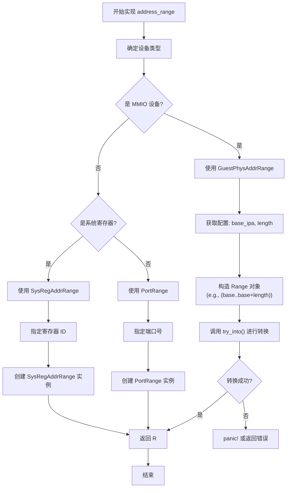

<cite>
**本文档引用的文件**
- [lib.rs](file://src/lib.rs)
- [test.rs](file://src/test.rs)
- [Cargo.toml](file://Cargo.toml)
- [README.md](file://README.md)
</cite>

## 目录
1. [引言](#引言)
2. [核心组件分析](#核心组件分析)
3. [address_range 方法详解](#address_range-方法详解)
4. [地址范围类型与硬件模型](#地址范围类型与硬件模型)
5. [实现示例与冲突避免](#实现示例与冲突避免)
6. [虚拟机监控器中的应用流程](#虚拟机监控器中的应用流程)
7. [内存安全与边界检查](#内存安全与边界检查)
8. [调试策略与日志建议](#调试策略与日志建议)
9. [结论](#结论)

## 引言

`axdevice_base` 是为 ArceOS 虚拟化平台设计的基础设备抽象库，旨在为 `no_std` 环境下的虚拟设备开发提供统一的核心接口。该库定义了所有模拟设备必须实现的通用行为规范，其中 `BaseDeviceOps` trait 的 `address_range` 方法扮演着至关重要的角色。此方法作为设备地址空间的声明机制，是虚拟机监控器（Hypervisor）进行资源管理、访问拦截和内存安全控制的关键信息来源。本文将深入剖析 `address_range` 方法的设计原理、具体实现及其在整个虚拟化系统中的作用。

## 核心组件分析

本节分析构成 `axdevice_base` 库核心功能的主要组件。

**Section sources**
- [lib.rs](file://src/lib.rs#L0-L83)
- [test.rs](file://src/test.rs#L0-L75)

### BaseDeviceOps Trait

`BaseDeviceOps` 是所有模拟设备必须实现的核心 trait。它通过泛型参数 `R: DeviceAddrRange` 实现了对不同类型地址空间的灵活支持，确保了接口的通用性和类型安全性。该 trait 定义了四个关键方法：
- `emu_type`: 返回设备的类型枚举。
- `address_range`: **返回设备所占用的地址范围**，这是本文档的重点。
- `handle_read`: 处理对该设备的读取操作。
- `handle_write`: 处理对该设备的写入操作。

这种设计模式将设备的静态元数据（如类型和地址范围）与动态行为（读写处理）清晰地分离，便于虚拟机监控器在初始化阶段收集信息，并在运行时高效地分发 I/O 请求。

```mermaid
classDiagram
class BaseDeviceOps[R] {
<<trait>>
+ emu_type() EmuDeviceType
+ address_range() R
+ handle_read(addr : R : : Addr, width : AccessWidth) AxResult<usize>
+ handle_write(addr : R : : Addr, width : AccessWidth, val : usize) AxResult
}
class GuestPhysAddrRange {
<<struct>>
+ start : GuestPhysAddr
+ end : GuestPhysAddr
}
class SysRegAddrRange {
<<struct>>
+ register_id : u32
}
class PortRange {
<<struct>>
+ port_number : u16
}
BaseDeviceOps <|-- BaseMmioDeviceOps : "type alias"
BaseDeviceOps <|-- BaseSysRegDeviceOps : "type alias"
BaseDeviceOps <|-- BasePortDeviceOps : "type alias"
BaseDeviceOps --> GuestPhysAddrRange : "R = "
BaseDeviceOps --> SysRegAddrRange : "R = "
BaseDeviceOps --> PortRange : "R = "
```

**Diagram sources**
- [lib.rs](file://src/lib.rs#L36-L70)
- [lib.rs](file://src/lib.rs#L73-L78)

## address_range 方法详解

`address_range` 方法是 `BaseDeviceOps` trait 中用于声明设备地址空间的核心方法。其签名如下：

```rust
fn address_range(&self) -> R;
```

其中，`R` 是一个满足 `DeviceAddrRange` 约束的关联类型。这意味着每个具体的设备实现都可以根据其硬件访问模型，选择最合适的地址范围表示方式。

### 关联类型 R: DeviceAddrRange 的含义

返回关联类型 `R: DeviceAddrRange` 的设计是此方法灵活性的关键。它允许不同的设备使用不同的数据结构来精确描述其地址空间，而不是强制使用一个单一的、可能不贴切的通用类型。这带来了以下优势：
1.  **类型安全**: 编译器可以确保传递给 `handle_read` 和 `handle_write` 方法的地址类型与 `address_range` 返回的范围类型完全匹配，从根本上防止了类型错误。
2.  **语义清晰**: 每种 `DeviceAddrRange` 的具体实现都承载了特定的硬件语义，使得代码意图更加明确。
3.  **扩展性强**: 可以轻松地为新的硬件访问模型添加新的 `DeviceAddrRange` 实现，而无需修改 `BaseDeviceOps` trait 的核心定义。

**Section sources**
- [lib.rs](file://src/lib.rs#L58-L60)

## 地址范围类型与硬件模型

`axdevice_base` 库通过 `axaddrspace` crate 提供了三种主要的 `DeviceAddrRange` 实现，分别对应三种常见的硬件访问模型。

### 三种实现及其对应模型

| 地址范围类型 | 对应的硬件访问模型 | 描述 |
| :--- | :--- | :--- |
| `GuestPhysAddrRange` | 内存映射 I/O (MMIO) | 表示一段连续的物理地址空间。设备寄存器被映射到客户机的物理地址（GPA）中，CPU 通过普通的内存加载/存储指令对其进行访问。 |
| `SysRegAddrRange` | 系统寄存器 (System Register) | 表示一个特定的系统寄存器。在 ARM 或 RISC-V 等架构中，某些控制功能通过特殊的寄存器指令（如 `MSR`, `MRS`）来访问。 |
| `PortRange` | 端口 I/O (Port I/O) | 表示一个 I/O 端口号。在 x86 架构中，外设通常通过专用的 `IN` 和 `OUT` 指令，配合端口号来访问。 |

这些类型通过 trait 别名进一步封装，提供了更直观的接口：
- `BaseMmioDeviceOps` = `BaseDeviceOps<GuestPhysAddrRange>`
- `BaseSysRegDeviceOps` = `BaseDeviceOps<SysRegAddrRange>`
- `BasePortDeviceOps` = `BaseDeviceOps<PortRange>`

**Section sources**
- [lib.rs](file://src/lib.rs#L73-L78)
- [lib.rs](file://src/lib.rs#L14-L15)

## 实现示例与冲突避免

### MMIO 设备实现示例

以下是一个 `test.rs` 文件中 `DeviceA` 的实现示例，展示了如何为 MMIO 设备实现 `address_range` 方法：

```rust
impl BaseDeviceOps<GuestPhysAddrRange> for DeviceA {
    fn address_range(&self) -> GuestPhysAddrRange {
        (0x1000..0x2000).try_into().unwrap()
    }
    // ... 其他方法
}
```

在此示例中，`DeviceA` 声明其地址范围为从 `0x1000` 到 `0x2000`（不包含）的客户机物理地址区间。

### 避免地址冲突的关键实践

确保不同设备的地址范围不重叠是系统稳定运行的前提。开发者在实现 `address_range` 时必须遵循以下原则：
1.  **唯一性**: 每个设备实例的地址范围必须是唯一的。
2.  **无重叠**: 不同设备的地址范围不能有任何交集。
3.  **配置驱动**: 在实际应用中，设备的基地址和长度通常由 `EmulatedDeviceConfig` 结构体传入，而非硬编码，以便于灵活配置。

在 `test.rs` 中，`DeviceB` 的地址范围为 `(0x2000..0x3000)`，与 `DeviceA` 的 `(0x1000..0x2000)` 紧密相邻但无重叠，这是一个良好的实践范例。



**Diagram sources**
- [test.rs](file://src/test.rs#L17-L18)
- [test.rs](file://src/test.rs#L44-L45)

**Section sources**
- [test.rs](file://src/test.rs#L10-L25)

## 虚拟机监控器中的应用流程

`address_range` 方法返回的信息是虚拟机监控器构建地址映射表和拦截 GPA 访问的核心依据。其关键流程如下：

1.  **设备发现与注册**: 当一个新的虚拟设备被创建并注册到虚拟机监控器时，系统会持有其 `Arc<dyn BaseDeviceOps<R>>` 的智能指针。
2.  **地址范围查询**: 虚拟机监控器调用该设备的 `address_range()` 方法，获取其声明的地址范围 `R`。
3.  **地址映射表构建**: 虚拟机监控器将此范围记录在其内部的地址映射表（或称为 I/O 映射表）中。这张表建立了“客户机物理地址区间”到“设备处理程序”的映射关系。
4.  **GPA 访问拦截**: 当客户机操作系统执行一条访问特定 GPA 的内存指令时，CPU 会产生一个异常（如 ARM 的 Data Abort 或 x86 的 #GP），并将控制权交给虚拟机监控器。
5.  **查表与分发**: 虚拟机监控器检查该 GPA 是否落在任何已注册设备的 `address_range` 内。如果命中，则调用相应设备的 `handle_read` 或 `handle_write` 方法来模拟硬件行为；否则，该访问可能被转发给真实的物理内存或其他处理逻辑。

这个流程确保了对虚拟设备的访问能够被精确地捕获和处理，是实现硬件虚拟化的基础。

**Section sources**
- [lib.rs](file://src/lib.rs#L58-L60)
- [test.rs](file://src/test.rs#L60-L70)

## 内存安全与边界检查

`address_range` 方法的实现对整个系统的内存安全至关重要。

### 边界检查的重要性

尽管 `address_range` 本身不直接执行边界检查，但它为后续的安全检查提供了必要的信息。`GuestPhysAddrRange` 类型的 `contains` 方法等工具，依赖于 `address_range` 返回的有效范围来进行判断。如果 `address_range` 返回了一个无效或过大的范围，可能会导致：
- **越界访问**: 设备处理程序可能尝试访问不属于它的内存区域，引发不可预知的行为或崩溃。
- **地址冲突**: 两个设备声称拥有同一段地址，导致 I/O 请求被错误地路由，破坏数据一致性。

### `try_into()` 的作用

在示例代码中，`(0x1000..0x2000).try_into().unwrap()` 的用法体现了防御性编程的思想。`try_into()` 方法在将标准的 Rust 范围 (`std::ops::Range`) 转换为 `GuestPhysAddrRange` 时，会进行合法性检查（例如，确保起始地址和结束地址是有效的物理地址）。如果转换失败，`unwrap()` 会导致进程 panic，这虽然在生产环境中需要更优雅的错误处理，但在测试和开发阶段能立即暴露配置错误，防止问题蔓延。

**Section sources**
- [test.rs](file://src/test.rs#L17)
- [test.rs](file://src/test.rs#L44)

## 调试策略与日志建议

当遇到因地址重叠或越界导致的访问异常时，可以采用以下调试策略：

1.  **启动时日志**: 在虚拟机监控器注册每个设备后，立即打印其名称和 `address_range`。这有助于快速发现配置错误。
    ```log
    INFO: Registered device 'UART0' at range [0x9000000, 0x9001000)
    INFO: Registered device 'RTC' at range [0x9001000, 0x9002000)
    ```
2.  **访问日志**: 在 `handle_read` 和 `handle_write` 方法的入口处，记录被访问的地址。当发生异常时，可以回溯是哪个设备收到了非法请求。
    ```log
    DEBUG: RTC device received write to addr 0x9001F00, value=0xAB
    ERROR: UART0 device received read request for addr 0x9002000 (out of bounds!)
    ```
3.  **范围验证工具**: 在设备初始化完成后，编写一个辅助函数，遍历所有已注册设备的 `address_range`，检查它们之间是否存在重叠。这可以在系统启动的最后阶段自动执行。
4.  **利用 `map_device_of_type`**: 如 `test.rs` 中所示，使用 `map_device_of_type` 函数可以安全地向下转型到具体设备类型，从而调用其特有的调试方法（如 `test_method`），这对于复杂的设备状态诊断非常有用。

**Section sources**
- [test.rs](file://src/test.rs#L60-L74)
- [lib.rs](file://src/lib.rs#L70-L72)

## 结论

`BaseDeviceOps` trait 中的 `address_range` 方法远不止是一个简单的 getter 函数。它是连接虚拟设备实现与虚拟机监控器资源管理框架的桥梁，是实现高效、安全硬件虚拟化的基石。通过返回一个符合 `DeviceAddrRange` 约束的关联类型，该方法为 MMIO、系统寄存器和端口 I/O 等不同硬件模型提供了类型安全且语义清晰的地址声明机制。开发者在实现此方法时，必须确保地址范围的唯一性和正确性，以避免冲突和越界访问。虚拟机监控器则依赖这些信息来构建地址映射表，精准地拦截和分发 I/O 请求。结合完善的日志记录和调试工具，可以有效保障系统的稳定性和可维护性。