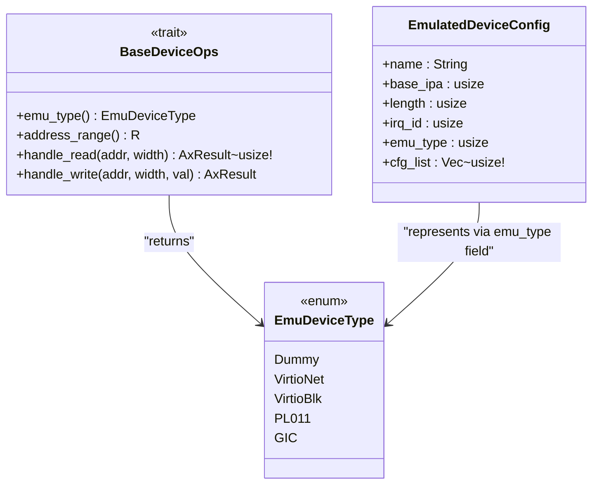

# emu_type 方法详解

<cite>
**Referenced Files in This Document**   
- [lib.rs](file://src/lib.rs)
- [test.rs](file://src/test.rs)
</cite>

## 目录
1. [引言](#引言)
2. [核心组件分析](#核心组件分析)
3. [emu_type 方法的设计与实现](#emu_type-方法的设计与实现)
4. [设备类型枚举 EmuDeviceType](#设备类型枚举-emudevicetype)
5. [在设备管理中的调用场景](#在设备管理中的调用场景)
6. [代码示例：具体设备中的实现](#代码示例：具体设备中的实现)
7. [与 map_device_of_type 的集成机制](#与-map_device_of_type-的集成机制)
8. [对系统可扩展性的影响](#对系统可扩展性的影响)
9. [常见错误与排查方法](#常见错误与排查方法)
10. [单元测试建议](#单元测试建议)

## 引言

在虚拟化系统中，准确识别和管理各类模拟设备是确保 I/O 请求正确路由和配置生效的关键。`BaseDeviceOps` trait 中的 `emu_type` 方法为此提供了一个标准化的设备类型标识机制。本文档将深入解析该方法的设计目的、实现方式及其在整个设备管理体系中的作用，旨在为开发者提供清晰的指导，以正确实现和使用此功能。

## 核心组件分析

本节分析构成设备类型识别系统的核心组件，包括 `BaseDeviceOps` trait 和 `EmuDeviceType` 枚举。



**Diagram sources**
- [lib.rs](file://src/lib.rs#L49-L54)

**Section sources**
- [lib.rs](file://src/lib.rs#L49-L83)

## emu_type 方法的设计与实现

`emu_type` 方法是 `BaseDeviceOps` trait 的一个核心方法，其主要设计目的是为每一个实现了该 trait 的设备实例提供一个明确的类型标识。这个标识符是一个 `EmuDeviceType` 枚举值，它允许运行时系统通过统一的接口查询任意设备的具体类型。

该方法的实现非常直接：任何具体的设备结构体在实现 `BaseDeviceOps` 时，都必须在其 `emu_type` 函数体中返回一个预定义的 `EmuDeviceType` 变体。这种设计遵循了 Rust 的 trait 系统原则，即强制要求所有实现者提供特定行为的实现，从而保证了类型信息的完整性和一致性。

**Section sources**
- [lib.rs](file://src/lib.rs#L50)

## 设备类型枚举 EmuDeviceType

`EmuDeviceType` 枚举（实际定义位于 `axvmconfig` crate）是系统中所有支持的模拟设备类型的集中声明。尽管在当前仓库中它是通过 `pub use axvmconfig::EmulatedDeviceType as EmuDeviceType;` 导入的类型别名，但其作用至关重要。每个枚举变体（如 `Dummy`, `VirtioNet`, `PL011` 等）代表了一种特定的硬件设备模型。

该枚举作为 `emu_type` 方法的返回类型，充当了静态类型系统与动态设备管理之间的桥梁。它使得设备类型成为一个编译时可知的安全类型，避免了使用字符串或整数常量可能带来的拼写错误和类型不安全问题。

**Section sources**
- [lib.rs](file://src/lib.rs#L28)

## 在设备管理中的调用场景

`emu_type` 方法在设备管理器的多个关键环节被调用：

1.  **设备分类**：当设备管理器需要根据类型对设备进行分组或筛选时，会遍历设备列表并调用每个设备的 `emu_type` 方法。
2.  **I/O 请求路由**：虽然具体的 I/O 处理由 `handle_read` 和 `handle_write` 方法处理，但设备的初始注册和地址空间分配往往依赖于其类型。`emu_type` 提供的信息可用于决定如何初始化和配置设备的地址范围。
3.  **配置校验**：在加载虚拟机配置时，`EmulatedDeviceConfig` 结构体中的 `emu_type` 字段（一个 `usize`）应与设备实例返回的 `EmuDeviceType` 枚举所对应的数值一致。通过比较两者，可以验证配置的有效性，防止因配置错误导致的设备无法正常工作。

**Section sources**
- [lib.rs](file://src/lib.rs#L15-L25)
- [lib.rs](file://src/lib.rs#L50)

## 代码示例：具体设备中的实现

以下是在具体设备中实现 `emu_type` 方法的典型模式。以 `src/test.rs` 中的 `DeviceA` 为例：

```rust
struct DeviceA;

impl BaseDeviceOps<GuestPhysAddrRange> for DeviceA {
    fn emu_type(&self) -> EmuDeviceType {
        EmuDeviceType::Dummy
    }
    // ... 其他方法的实现
}
```

在此示例中，`DeviceA` 明确地将其类型声明为 `EmuDeviceType::Dummy`。任何新的设备实现都必须遵循相同的模式，在 `emu_type` 方法中返回其对应的枚举值。这确保了无论设备的具体逻辑如何复杂，其类型标识始终是清晰且一致的。

**Section sources**
- [test.rs](file://src/test.rs#L12-L13)

## 与 map_device_of_type 的集成机制

`map_device_of_type` 函数是利用 `emu_type` 所提供的类型信息进行安全向下转型的关键工具。虽然 `emu_type` 返回的是一个高层次的类型标签，而 `map_device_of_type` 则利用 Rust 的 `Any` trait 进行实际的类型检查和转换。

其工作流程如下：
1.  接收一个指向 `dyn BaseDeviceOps` 的 `Arc` 智能指针。
2.  尝试将该指针向下转型为指定的具体设备类型 `T`。
3.  如果转型成功，则调用提供的闭包函数 `f` 并传入具体类型的引用。
4.  如果转型失败（即设备不是目标类型），则返回 `None`。

这种方式与 `emu_type` 形成了互补：`emu_type` 用于快速查询和分类，而 `map_device_of_type` 用于在确认类型后执行针对特定设备的专有操作。例如，文档中的测试用例就使用此函数来调用 `DeviceA` 特有的 `test_method`。

**Section sources**
- [lib.rs](file://src/lib.rs#L57-L67)
- [test.rs](file://src/test.rs#L68-L75)

## 对系统可扩展性的影响

`emu_type` 方法的设计对系统的可扩展性有着深远影响：

*   **新增设备类型**：要添加一种全新的设备类型（如 `VirtioGpu`），开发者必须首先在 `axvmconfig` crate 的 `EmuDeviceType` 枚举中添加一个新的变体。
*   **更新匹配逻辑**：随后，在任何使用 `match` 语句或条件判断来处理不同 `EmuDeviceType` 的代码中（例如设备工厂、配置解析器等），都必须更新这些逻辑以包含新类型。这通常表现为编译错误，强制开发者完成必要的适配，从而保证了类型安全。

这种“一处修改，多处提醒”的机制，虽然在添加新类型时需要额外的工作，但它极大地降低了因遗漏处理分支而导致的运行时错误风险，是构建健壮系统的重要保障。

**Section sources**
- [lib.rs](file://src/lib.rs#L28)
- [lib.rs](file://src/lib.rs#L50)

## 常见错误与排查方法

开发者在使用 `emu_type` 时可能会遇到以下常见问题：

*   **返回错误类型**：如果一个设备（如 `VirtioNet`）错误地返回了 `EmuDeviceType::PL011`，会导致设备管理器将其误认为串口设备。这将造成 I/O 请求被错误地路由，最终导致网络功能失效。
*   **配置不匹配**：`EmulatedDeviceConfig` 中的 `emu_type` 字段值与设备实例返回的枚举值不一致，可能导致设备初始化失败或被忽略。

**排查方法**：
1.  首先检查具体设备实现中 `emu_type` 方法的返回值是否正确。
2.  确认 `EmulatedDeviceConfig` 的配置文件或代码中，`emu_type` 字段的值与预期设备类型相符。
3.  在设备注册和初始化的关键路径上添加日志，打印出设备的名称和其 `emu_type` 返回值，以便于追踪。

**Section sources**
- [lib.rs](file://src/lib.rs#L15-L25)
- [lib.rs](file://src/lib.rs#L50)

## 单元测试建议

为了确保 `emu_type` 方法的正确性，强烈建议编写单元测试：

*   **类型一致性测试**：为每个设备实现编写测试，断言其 `emu_type` 方法返回预期的枚举值。
*   **转换功能测试**：像 `src/test.rs` 中的 `test_device_type_test` 一样，测试 `map_device_of_type` 能否成功地从通用设备集合中提取出特定类型的设备并调用其专有方法。

这些测试可以在每次代码变更后自动运行，有效防止因疏忽导致的类型错误，是维护代码质量的重要手段。

**Section sources**
- [test.rs](file://src/test.rs#L68-L75)