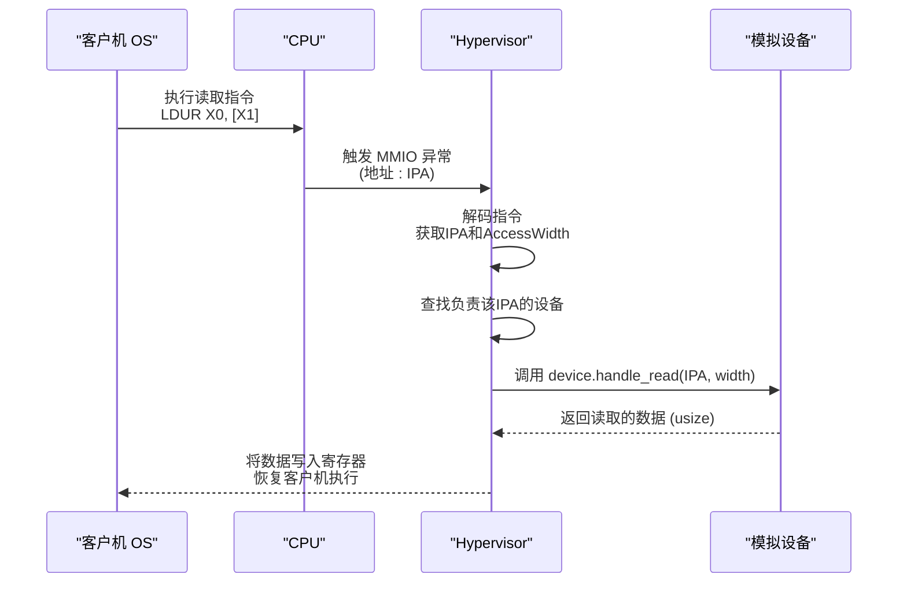
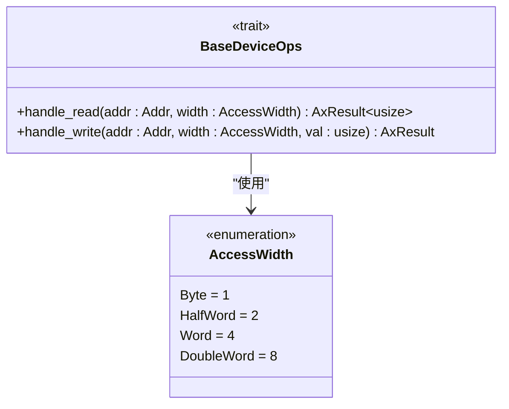

# handle_read 方法详解

<cite>
**Referenced Files in This Document **   
- [lib.rs](file://src/lib.rs)
- [test.rs](file://src/test.rs)
</cite>

## 目录
1. [引言](#引言)
2. [核心职责与调用机制](#核心职责与调用机制)
3. 参数语义解析
   - [offset (addr) 参数](#offset-addr-参数)
   - [data 缓冲区与 AccessWidth](#data-缓冲区与-accesswidth)
4. [读取请求处理流程](#读取请求处理流程)
5. [常见问题与解决方案](#常见问题与解决方案)
6. [最佳实践建议](#最佳实践建议)

## 引言

`handle_read` 是 `BaseDeviceOps` trait 中定义的关键方法，为 ArceOS 虚拟化平台中的所有模拟设备提供了统一的读操作接口。该方法是实现 trap-and-emulate（捕获与模拟）机制的核心组件，使得虚拟机监控器（Hypervisor）能够安全、高效地拦截并响应客户机操作系统对硬件设备的访问。

本文档旨在深入剖析 `handle_read` 方法的设计、语义和实现细节，为开发人员提供一份详尽的参考指南，以确保正确实现设备模拟逻辑。

**Section sources**
- [lib.rs](file://src/lib.rs#L36-L70)

## 核心职责与调用机制

`handle_read` 方法的核心职责是**模拟一个物理设备在特定地址上的读取行为**。当客户机操作系统尝试从其地址空间中映射的设备区域读取数据时，CPU 会触发一个异常（如 MMIO 访问异常）。这个异常被 Hypervisor 捕获后，便启动了 trap-and-emulate 机制。

在此机制下，Hypervisor 会分析导致异常的指令，确定访问的物理地址和访问宽度。随后，它会在内部维护的设备列表中查找哪个模拟设备负责该地址范围，并最终调用该设备实例上实现的 `handle_read` 方法。因此，`handle_read` 的调用时机是由客户机的非法或特殊内存访问所触发的，是整个设备模拟流程的关键执行点。

**Diagram sources **
- [lib.rs](file://src/lib.rs#L36-L70)
- [test.rs](file://src/test.rs#L45-L50)

## 参数语义解析

### offset (addr) 参数

`handle_read` 方法的第一个参数 `addr` 在文档目标中被称为 `offset`，它表示**相对于设备地址空间起始位置的偏移量**。更准确地说，`addr` 是客户机试图访问的完整中间物理地址（Intermediate Physical Address, IPA）。

例如，在 `test.rs` 文件中，`DeviceA` 的地址范围被定义为 `0x1000..0x2000`。如果客户机尝试从 `0x1500` 读取，那么传入 `handle_read` 的 `addr` 值就是 `0x1500`。开发者需要将此地址与设备自身的基址进行比较，以计算出真正的偏移量，并据此决定返回何种数据。

**Section sources**
- [test.rs](file://src/test.rs#L45-L50)

### data 缓冲区与 AccessWidth

在当前代码库的实现中，`handle_read` 方法并未直接接收一个名为 `data` 的输出缓冲区作为参数。相反，它通过返回值 `AxResult<usize>` 来传递读取到的数据。这里的 `usize` 类型充当了“数据”的角色，其大小取决于目标平台（在 64 位系统上为 8 字节）。

真正用于指定访问宽度的是第二个参数 `width`，其类型为 `AccessWidth` 枚举。该枚举精确地定义了客户机期望的读取操作的字节宽度，这对于正确模拟设备行为至关重要。

**Diagram sources **
- [lib.rs](file://src/lib.rs#L36-L70)

## 读取请求处理流程

处理一个读取请求的标准流程如下：

1.  **地址校验**：首先检查传入的 `addr` 是否落在设备通过 `address_range()` 方法声明的有效范围内。如果地址超出范围，应返回错误。
2.  **宽度解析**：根据 `AccessWidth` 参数的值（`Byte`, `HalfWord`, `Word`, `DoubleWord`），确定本次读取操作的语义。这决定了应该从设备的内部状态中提取多少数据以及如何组织它们。
3.  **数据生成**：根据设备的具体功能，生成对应地址和宽度的有效数据。例如，对于一个简单的计数器设备，可能返回一个递增的值；对于一个配置寄存器，则返回其当前的配置位。
4.  **返回结果**：将生成的数据封装在 `Ok(usize)` 中返回。如果在处理过程中发生任何错误（如不支持的访问宽度），则返回相应的 `Err`。

在 `test.rs` 的示例中，`DeviceA` 和 `DeviceB` 实现了一个简化的逻辑：直接将传入的地址 `addr` 转换为 `usize` 并返回。这主要用于测试目的，展示了方法的基本调用模式。

**Section sources**
- [test.rs](file://src/test.rs#L45-L50)

## 常见问题与解决方案

*   **问题：数据字节序错误 (Endianness Issues)**  
    **描述**：在多字节访问（如 `Word` 或 `DoubleWord`）时，返回的数据字节顺序与客户机预期不符。  
    **解决方案**：明确了解 Hypervisor 和客户机的字节序约定。通常，RISC-V 等架构是小端序（Little-Endian）。在构造返回的 `usize` 值时，必须确保字节排列正确。可以使用标准库中的 `to_le_bytes()` / `from_le_bytes()` 等方法进行转换。

*   **问题：未初始化的返回值**  
    **描述**：对于某些未实现或保留的寄存器地址，`handle_read` 返回了随机的 `usize` 值，可能导致客户机行为异常。  
    **解决方案**：为所有可能的地址范围定义明确的行为。对于未实现的寄存器，应返回一个默认的安全值（如全零 `0x0`），并在文档中说明。

*   **问题：访问宽度不支持**  
    **描述**：客户机发起了一次设备不支持的访问宽度（例如，设备只支持 32 位访问，但客户机尝试进行 8 位访问）。  
    **解决方案**：在 `handle_read` 实现中，使用 `match` 语句检查 `width` 参数。对于不支持的宽度，立即返回一个错误（如 `AxResult::Err(AxError::InvalidInput)`）。

## 最佳实践建议

为了确保 `handle_read` 方法的健壮性和可维护性，建议遵循以下最佳实践：

*   **使用断言 (Assertions)**：在开发和调试阶段，使用 `assert!` 宏来验证关键假设，例如地址是否在范围内。这有助于及早发现编程错误。
*   **全面的覆盖率测试**：编写单元测试，覆盖所有可能的地址、所有支持的 `AccessWidth` 枚举值以及边界情况（如地址范围的首尾地址）。`test.rs` 文件中的 `test_device_type_test` 函数提供了一个基本的测试框架。
*   **清晰的日志记录**：在 `handle_read` 中添加适当的日志，记录每次访问的地址和宽度。这对于调试复杂的设备交互非常有帮助。
*   **保持幂等性**：除非设备本身具有状态（如 FIFO 队列），否则多次读取同一地址应返回相同的数据，以符合大多数硬件设备的预期行为。