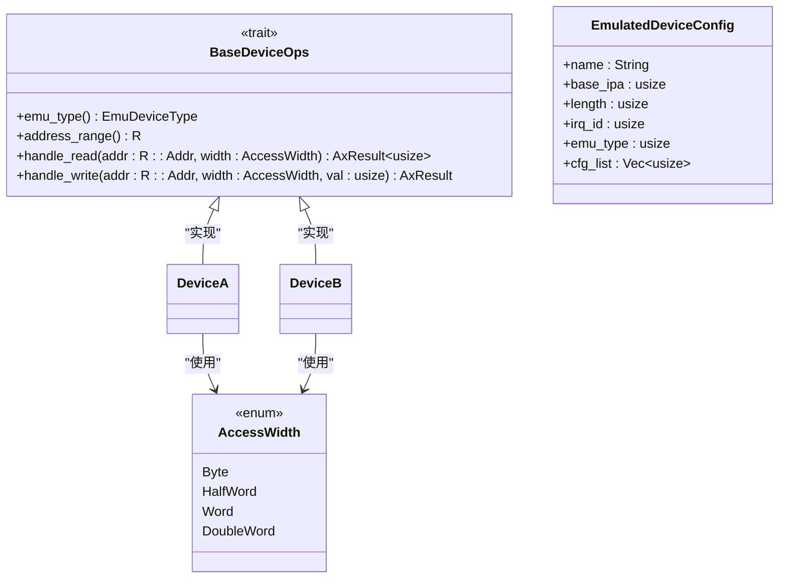
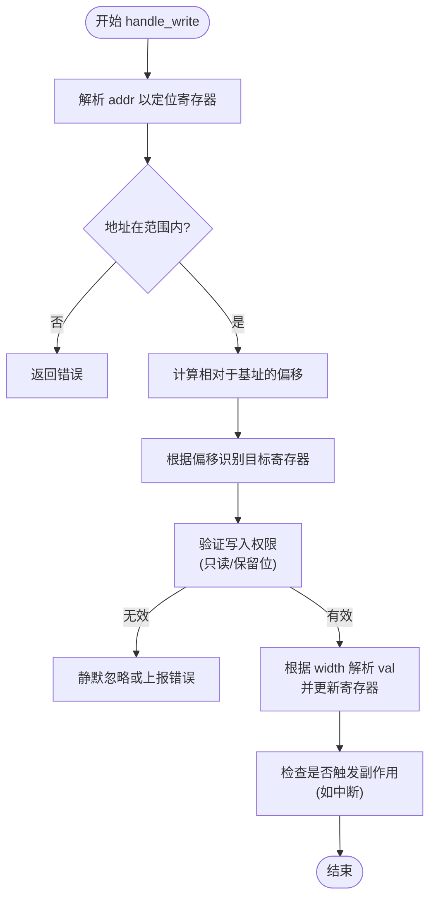

<cite>
**本文档引用的文件**
- [lib.rs](file://src/lib.rs)
- [test.rs](file://src/test.rs)
</cite>

## 目录
1. [引言](#引言)
2. [核心组件分析](#核心组件分析)
3. [handle_write 方法详解](#handle_write-方法详解)
4. [参数协同工作机制](#参数协同工作机制)
5. [非法写入处理策略](#非法写入处理策略)
6. [异步行为与中断交互](#异步行为与中断交互)
7. [调试与测试指南](#调试与测试指南)
8. [结论](#结论)

## 引言

`BaseDeviceOps` trait 是 ArceOS 虚拟化子系统中所有模拟设备必须实现的核心接口。该文档深入探讨其 `handle_write` 方法，重点阐述其在响应虚拟设备写操作中的关键作用。通过分析代码结构和示例，本文将详细解释该方法如何安全地解析输入数据、执行副作用操作，并处理各种边界情况。

## 核心组件分析

本节分析构成设备模拟基础的关键组件。

**Diagram sources**
- [lib.rs](file://src/lib.rs#L36-L70)
- [test.rs](file://src/test.rs#L15-L45)

**Section sources**
- [lib.rs](file://src/lib.rs#L1-L83)
- [test.rs](file://src/test.rs#L1-L75)

## handle_write 方法详解

`handle_write` 方法是 `BaseDeviceOps` trait 的核心组成部分，负责处理对模拟设备的写入请求。它定义了所有具体设备实现必须遵循的统一接口。

该方法接收三个主要参数：目标地址（`addr`）、访问宽度（`width`）和待写入的值（`val`）。其实现逻辑通常涉及定位到具体的寄存器或内存区域，根据访问粒度安全地解析和修改数据，并可能触发一系列内部状态变更或外部事件。

在提供的测试代码中，`DeviceA` 和 `DeviceB` 都实现了此方法，尽管它们目前只是简单地返回成功状态，但这为更复杂的逻辑提供了扩展点。

**Section sources**
- [lib.rs](file://src/lib.rs#L65-L70)
- [test.rs](file://src/test.rs#L40-L45)

## 参数协同工作机制

`handle_write` 方法的三个参数协同工作，以精确地描述一次写操作。

### 地址偏移 (addr)
`addr` 参数指定了写操作的目标物理地址。结合设备自身的地址范围（由 `address_range()` 方法提供），可以计算出相对于设备基址的偏移量，从而精确定位到需要修改的特定寄存器。

### 写入数据 (val)
`val` 参数携带了要写入的实际数值。这个值的解释和应用完全取决于目标寄存器的规范。例如，它可以是一个控制位的掩码、一个配置阈值，或是外设的数据缓冲区内容。

### 访问宽度 (width)
`width` 参数是一个 `AccessWidth` 枚举类型，指示了本次访问的粒度。这确保了模拟器能够正确处理不同大小的数据访问，避免因字节序或对齐问题导致的行为不一致。

**Diagram sources**
- [lib.rs](file://src/lib.rs#L65-L70)
- [test.rs](file://src/test.rs#L40-L45)

**Section sources**
- [lib.rs](file://src/lib.rs#L65-L70)

## 非法写入处理策略

对于非法写入操作，稳健的设备模拟器应具备明确的处理策略。

### 只读寄存器
向只读寄存器写入数据是一种常见的非法操作。最佳实践通常是**静默忽略**此类写入，即方法正常返回成功，但不对寄存器内容做任何修改。这种行为符合许多真实硬件的设计，有助于提高兼容性。

### 保留位写入
寄存器中的保留位（Reserved Bits）不应被软件修改。当检测到对保留位的写入时，模拟器可以选择：
1.  **屏蔽保留位**：在更新寄存器前，将 `val` 中对应保留位的部分清零。
2.  **上报错误**：返回一个错误码（如 `AxResult::Err`），通知调用者操作失败。

选择哪种策略取决于具体的设备规范和虚拟化需求。

**Section sources**
- [lib.rs](file://src/lib.rs#L65-L70)

## 异步行为与中断交互

`handle_write` 方法虽然同步执行，但其副作用可能是异步的。

### 触发中断
许多设备在接收到特定的写命令后会触发中断。例如，向一个“发送”寄存器写入数据可能会启动一个DMA传输，完成后由设备控制器向虚拟中断控制器注入一个中断信号。

### 与虚拟中断控制器的交互
为了实现这一点，设备实现需要持有对虚拟中断控制器的引用。在 `handle_write` 的逻辑中，一旦满足触发条件（如设置了某个中断使能位），设备就会调用中断控制器的API来注入中断。这通常涉及到更新中断状态寄存器，并通知VMM调度相应的中断处理程序。

尽管当前的示例代码未展示此逻辑，但这是 `handle_write` 方法在复杂设备中一个非常重要的应用场景。

**Section sources**
- [lib.rs](file://src/lib.rs#L65-L70)

## 调试与测试指南

### 日志记录建议
在 `handle_write` 的入口处添加日志，记录 `addr`、`width` 和 `val` 的值，对于调试设备行为至关重要。这有助于追踪 guest OS 的驱动程序活动。

### 边界条件测试用例
应设计以下测试用例：
- 向设备地址范围之外的地址写入。
- 使用非对齐地址进行非字节宽度的写入。
- 向只读寄存器写入数据，验证其是否被忽略。
- 向包含保留位的寄存器写入，验证保留位是否被正确处理。

### 竞态条件预防
如果设备状态被多个线程（如VCPUs）并发访问，`handle_write` 的实现必须保证线程安全。这通常通过内部锁（如 `Mutex`）来实现，确保对共享状态的修改是原子的。

**Section sources**
- [test.rs](file://src/test.rs#L40-L45)

## 结论

`BaseDeviceOps` trait 中的 `handle_write` 方法是构建可靠、高效虚拟设备的基石。它不仅提供了一个标准化的写操作接口，还为实现复杂的设备行为（如状态管理、中断生成）奠定了基础。通过遵循本文所述的最佳实践——包括正确的参数处理、非法写入的鲁棒性处理以及清晰的异步交互模式——开发者可以创建出高度兼容且易于维护的设备模拟器。