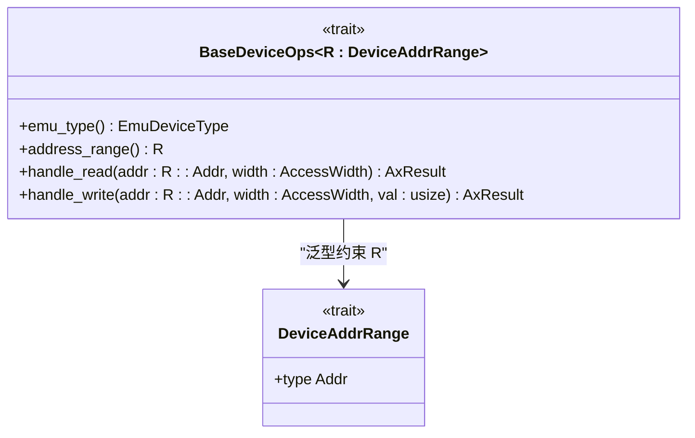
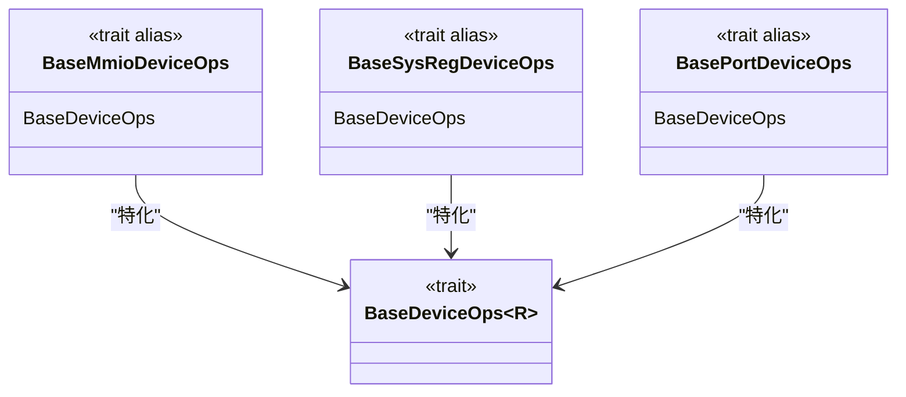
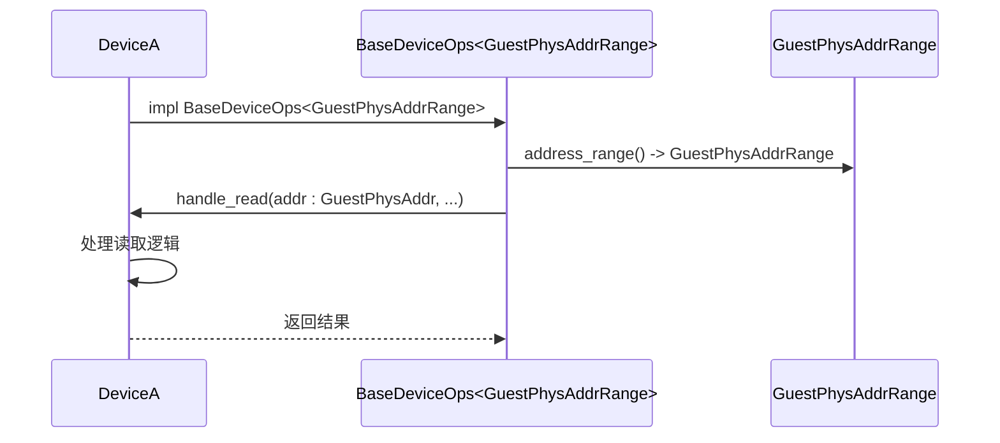

<cite>
**本文档中引用的文件**
- [lib.rs](file://src/lib.rs)
- [test.rs](file://src/test.rs)
</cite>

## 目录
1. [引言](#引言)
2. [核心组件分析](#核心组件分析)
3. [DeviceAddrRange 关联类型详解](#deviceaddrrange-关联类型详解)
4. [具体地址范围类型](#具体地址范围类型)
5. [类型安全性与编译期检查](#类型安全性与编译期检查)
6. [实际应用示例](#实际应用示例)
7. [设计优势与局限性](#设计优势与局限性)
8. [总结](#总结)

## 引言

本文档旨在深入解析 `axdevice_base` 库中 `DeviceAddrRange` 关联类型的设计原理与实现机制。该类型作为 `BaseDeviceOps` trait 的关键泛型约束，为不同类型的设备（如内存映射I/O、系统寄存器、端口I/O）提供了统一且类型安全的地址空间抽象。通过分析其在代码库中的定义和使用方式，本文将阐述这一设计如何有效防止跨地址空间的非法访问，并提升虚拟化环境中设备模拟的安全性与可靠性。

## 核心组件分析

本节分析构成设备操作基础的核心组件，包括 `BaseDeviceOps` trait 及其相关的类型别名。

### BaseDeviceOps Trait 分析

`BaseDeviceOps` 是所有模拟设备必须实现的核心 trait，它定义了设备的基本行为接口。该 trait 采用泛型参数 `R`，要求其必须实现 `DeviceAddrRange` trait，从而将具体的地址空间表示与设备操作逻辑解耦。

**Diagram sources**
- [lib.rs](file://src/lib.rs#L36-L70)

**Section sources**
- [lib.rs](file://src/lib.rs#L36-L70)

### 设备操作类型别名

为了简化常用设备类型的定义，库中提供了三个基于 `BaseDeviceOps` 的 trait 别名：

这些别名分别对应于内存映射I/O设备、系统寄存器设备和端口I/O设备，使得开发者可以更直观地声明设备类型。

**Diagram sources**
- [lib.rs](file://src/lib.rs#L66-L82)

**Section sources**
- [lib.rs](file://src/lib.rs#L66-L82)

## DeviceAddrRange 关联类型详解

`DeviceAddrRange` 是一个关键的 trait，它被用作 `BaseDeviceOps` 的泛型约束，以抽象不同设备的地址空间表示。

### 核心作用与设计目的

`DeviceAddrRange` 的主要作用是作为一个标记 trait 和关联类型容器，确保不同类型设备的地址空间在类型系统层面是不兼容的。这种设计遵循了“让错误在编译时发生”的原则。

#### 类型安全保证

通过将 `DeviceAddrRange` 作为泛型参数，`BaseDeviceOps` 能够确保：
- 不同地址空间类型的设备实例无法被混用。
- 设备处理函数 (`handle_read`, `handle_write`) 接收的地址参数类型 (`R::Addr`) 与其地址范围类型严格匹配。

### 内存布局与零成本抽象

尽管 `DeviceAddrRange` 在运行时没有开销（零成本抽象），但它在编译时提供了强大的类型检查。具体的地址范围类型（如 `GuestPhysAddrRange`）通常会包含起始和结束地址，并可能实现 `TryFrom<Range<T>>` 等 trait 来进行安全的构造。

## 具体地址范围类型

虽然具体的 `GuestPhysAddrRange`、`SysRegAddrRange` 和 `PortRange` 类型定义位于 `axaddrspace` 库中，但它们在此处被用作 `DeviceAddrRange` 的具体实现。

### 类型分类与用途

| 地址范围类型 | 用途 | 对应的设备操作别名 |
| :--- | :--- | :--- |
| `GuestPhysAddrRange` | 表示客户机物理地址空间中的内存区域，用于内存映射I/O (MMIO) 设备 | `BaseMmioDeviceOps` |
| `SysRegAddrRange` | 表示系统寄存器的地址空间，用于模拟对CPU系统寄存器的访问 | `BaseSysRegDeviceOps` |
| `PortRange` | 表示I/O端口地址空间，用于传统的端口I/O (PIO) 设备 | `BasePortDeviceOps` |

这些类型在语义上是完全独立的，即使它们的底层数据结构可能相似，但在类型系统中被视为不同的实体。

## 类型安全性与编译期检查

`DeviceAddrRange` 设计的核心优势在于其提供的编译期类型安全。

### 防止非法访问

该设计能有效防止以下几类错误：
- **跨地址空间访问**：无法将一个 MMIO 设备的地址传递给一个期望端口地址的函数。
- **类型混淆**：无法将 `SysRegAddrRange` 类型的设备误认为是 `GuestPhysAddrRange` 类型的设备。

### 编译期验证流程

当编译器遇到 `impl BaseDeviceOps<GuestPhysAddrRange> for MyDevice` 这样的实现时，它会：
1. 检查 `GuestPhysAddrRange` 是否实现了 `DeviceAddrRange` trait。
2. 验证 `handle_read` 和 `handle_write` 方法的签名是否正确，特别是 `addr` 参数的类型必须是 `GuestPhysAddrRange::Addr`（即 `GuestPhysAddr`）。
3. 在调用这些方法时，强制传入正确的地址类型。

## 实际应用示例

本节通过代码示例展示 `DeviceAddrRange` 的实际应用。

### 设备结构体实现

以下是一个典型的设备实现示例，展示了如何将特定的地址范围类型绑定到设备结构体上。

此序列图展示了 `DeviceA` 如何实现 `BaseDeviceOps` 并指定其地址范围为 `GuestPhysAddrRange`。

**Diagram sources**
- [test.rs](file://src/test.rs#L9-L34)

**Section sources**
- [test.rs](file://src/test.rs#L9-L34)

## 设计优势与局限性

### 设计优势

1. **强类型安全**：从根本上杜绝了地址空间混淆的运行时错误。
2. **代码清晰性**：通过 trait 别名，使代码意图更加明确。
3. **可扩展性**：易于添加新的地址空间类型，只需实现 `DeviceAddrRange` trait 并创建相应的 trait 别名。

### 局限性与挑战

1. **泛型复杂度增加**：对于初学者而言，理解泛型约束和关联类型需要一定的 Rust 经验。
2. **编译错误信息可能晦涩**：当出现类型不匹配时，编译器的错误信息有时难以理解。
3. **依赖外部库**：具体的地址范围类型定义在 `axaddrspace` 库中，增加了模块间的耦合。

### 简化使用的建议模式

- **广泛使用 trait 别名**：鼓励开发者直接使用 `BaseMmioDeviceOps` 等别名，而非直接写 `BaseDeviceOps<GuestPhysAddrRange>`。
- **提供清晰的文档和示例**：为常见的设备类型提供模板代码。
- **利用 IDE 支持**：现代 IDE 能很好地处理泛型，提供自动补全和错误提示，降低学习门槛。

## 总结

`DeviceAddrRange` 关联类型是 `axdevice_base` 库中一项精巧的设计，它利用 Rust 的强大类型系统，为虚拟化环境中的设备模拟提供了坚实的安全保障。通过将地址空间表示抽象为泛型约束，该设计成功地将潜在的运行时错误转移到了编译期，极大地提升了系统的健壮性。尽管引入了一定的泛型复杂度，但其带来的类型安全性和代码清晰性收益远超成本。未来可以通过提供更丰富的工具和文档来进一步降低新开发者的入门难度。