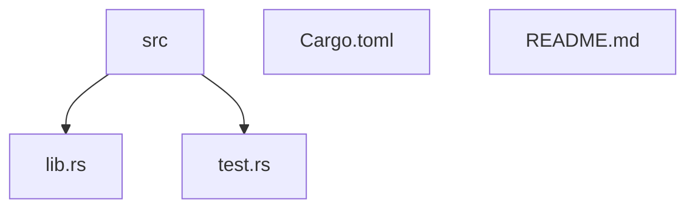
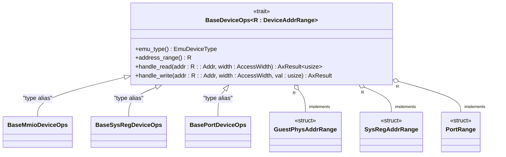
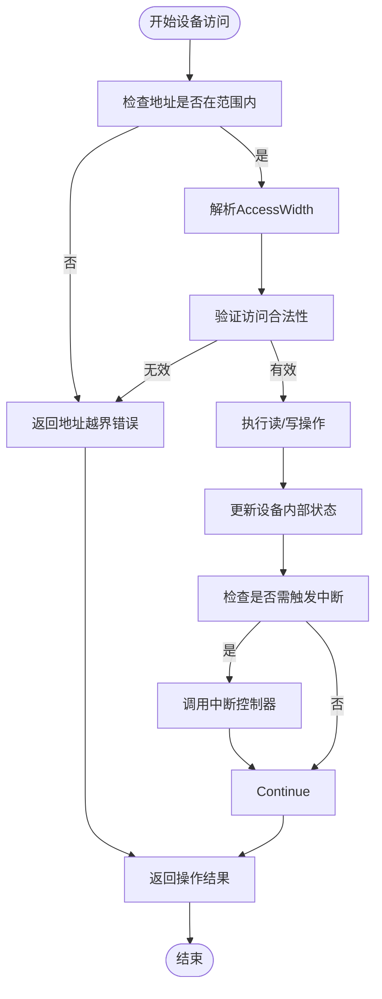

# 核心接口

<cite>
**本文档中引用的文件**
- [lib.rs](file://src/lib.rs)
- [test.rs](file://src/test.rs)
- [Cargo.toml](file://Cargo.toml)
- [README.md](file://README.md)
</cite>

## 目录
1. [简介](#简介)
2. [项目结构](#项目结构)
3. [核心组件](#核心组件)
4. [BaseDeviceOps trait 详解](#basedeviceops-trait-详解)
5. [关联类型 R: DeviceAddrRange 的设计意图](#关联类型-r-deviceaddrrange-的设计意图)
6. [trait 对象的多态应用与性能分析](#trait-对象的多态应用与性能分析)
7. [实现挑战与最佳实践](#实现挑战与最佳实践)
8. [调试技巧与测试策略](#调试技巧与测试策略)
9. [结论](#结论)

## 简介

`axdevice_base` 是 ArceOS 虚拟化子系统中的基础设备抽象库，专为 `no_std` 环境设计。该库定义了虚拟设备开发所需的核心接口和数据结构，其中最关键的公共接口是 `BaseDeviceOps` trait。此文档将深入剖析该 trait 的每个方法语义、参数含义、返回值约定及调用上下文，并通过具体示例展示如何为虚拟 UART 或其他设备类型实现此接口。

**Section sources**
- [lib.rs](file://src/lib.rs#L0-L83)
- [README.md](file://README.md#L0-L45)

## 项目结构

本项目的目录结构简洁明了，包含源码、测试和配置文件：

```
.
├── src
│   ├── lib.rs          # 核心 trait 和结构定义
│   └── test.rs         # 单元测试实现
├── Cargo.toml          # 构建和依赖配置
└── README.md           # 项目说明文档
```

`src/lib.rs` 文件定义了所有核心接口，`test.rs` 提供了具体的实现示例和测试用例，`Cargo.toml` 声明了项目依赖关系。



**Diagram sources**
- [lib.rs](file://src/lib.rs#L0-L83)
- [test.rs](file://src/test.rs#L0-L75)

**Section sources**
- [lib.rs](file://src/lib.rs#L0-L83)
- [test.rs](file://src/test.rs#L0-L75)
- [Cargo.toml](file://Cargo.toml#L0-L17)
- [README.md](file://README.md#L0-L45)

## 核心组件

`axdevice_base` 库的核心组件包括：
- `BaseDeviceOps` trait：所有模拟设备必须实现的基础操作接口
- `EmulatedDeviceConfig` 结构体：用于虚拟设备初始化的配置信息
- `EmuDeviceType` 枚举：表示模拟设备类型的枚举（来自 `axvmconfig` crate）
- 特性别名：`BaseMmioDeviceOps`、`BaseSysRegDeviceOps` 和 `BasePortDeviceOps`，分别对应不同地址空间模型的便捷类型

这些组件共同构成了虚拟设备开发的基础框架，确保了设备接口的一致性和可扩展性。

**Section sources**
- [lib.rs](file://src/lib.rs#L36-L70)

## BaseDeviceOps trait 详解

`BaseDeviceOps<R: DeviceAddrRange>` 是所有模拟设备必须实现的核心 trait，它定义了四个关键方法，每个方法都有明确的语义和调用约定。

### emu_type 方法

`fn emu_type(&self) -> EmuDeviceType;`

该方法返回模拟设备的类型标识。在虚拟机环境中，设备调度器可以根据此类型信息进行设备识别和路由决策。返回值为 `EmuDeviceType` 枚举类型，该枚举已从当前 crate 移至 `axvmconfig` crate 中统一管理。

**Section sources**
- [lib.rs](file://src/lib.rs#L50-L51)

### address_range 方法

`fn address_range(&self) -> R;`

该方法返回设备所占用的地址范围，其返回类型为泛型参数 `R`，必须满足 `DeviceAddrRange` trait 约束。这个地址范围决定了设备在内存或 I/O 空间中的映射位置，是设备访问路由的关键依据。

**Section sources**
- [lib.rs](file://src/lib.rs#L52-L53)

### handle_read 方法

`fn handle_read(&self, addr: R::Addr, width: AccessWidth) -> AxResult<usize>;`

该方法处理对设备的读取操作。参数 `addr` 表示相对于设备基地址的偏移量，类型为 `R::Addr`（由地址范围类型决定）；`width` 表示访问宽度，使用 `AccessWidth` 枚举指定（如字节、半字、字等）。返回值为 `AxResult<usize>`，成功时包含读取的数据值，失败时携带错误信息。此方法的实现需要考虑读取操作的原子性保证和访问宽度的正确解析。

**Section sources**
- [lib.rs](file://src/lib.rs#L54-L55)

### handle_write 方法

`fn handle_write(&self, addr: R::Addr, width: AccessWidth, val: usize) -> AxResult;`

该方法处理对设备的写入操作。参数与 `handle_read` 类似，额外包含 `val` 参数表示要写入的数据值。返回值为 `AxResult<()>`，仅表示操作是否成功。写入操作的实现通常需要集成中断触发逻辑，当特定寄存器被修改时通知虚拟机监控器。

**Section sources**
- [lib.rs](file://src/lib.rs#L56-L57)

## 关联类型 R: DeviceAddrRange 的设计意图

`BaseDeviceOps` trait 使用泛型参数 `R: DeviceAddrRange` 来支持不同的地址空间模型，这种设计提供了极大的灵活性和类型安全性。

### 支持的地址空间模型

- `GuestPhysAddrRange`：用于内存映射 I/O (MMIO) 设备，表示客户机物理地址范围
- `SysRegAddrRange`：用于系统寄存器设备，表示特殊寄存器的寻址范围
- `PortRange`：用于端口 I/O 设备，表示传统 I/O 端口地址范围

### 特性别名的应用

为了简化常见场景下的使用，库中定义了三个特性别名：

```rust
pub trait BaseMmioDeviceOps = BaseDeviceOps<GuestPhysAddrRange>;
pub trait BaseSysRegDeviceOps = BaseDeviceOps<SysRegAddrRange>;
pub trait BasePortDeviceOps = BaseDeviceOps<PortRange>;
```

这些别名使得开发者可以更直观地声明设备类型，例如实现 MMIO 设备时可以直接使用 `impl BaseMmioDeviceOps for MyDevice`，而无需显式指定泛型参数。



**Diagram sources**
- [lib.rs](file://src/lib.rs#L66-L82)

**Section sources**
- [lib.rs](file://src/lib.rs#L66-L82)

## trait 对象的多态应用与性能分析

`BaseDeviceOps` 通过 trait 对象实现了运行时多态，允许将不同类型的设备统一管理。库中提供的 `map_device_of_type` 函数展示了如何安全地进行向下转型：

```rust
pub fn map_device_of_type<T: BaseDeviceOps<R>, R: DeviceAddrRange, U, F: FnOnce(&T) -> U>(
    device: &Arc<dyn BaseDeviceOps<R>>,
    f: F,
) -> Option<U> {
    let any_arc: Arc<dyn Any> = device.clone();
    any_arc.downcast_ref::<T>().map(f)
}
```

这种方法利用 `Any` trait 实现类型安全的转换，在设备注册和调度过程中非常有用。然而，由于涉及动态分发和堆分配（`Arc`），会带来一定的性能开销。对于性能敏感的路径，应尽量减少频繁的类型检查和转换操作。

**Section sources**
- [lib.rs](file://src/lib.rs#L59-L65)

## 实现挑战与最佳实践

实现 `BaseDeviceOps` trait 时可能遇到以下挑战：

### 读写操作的原子性保证

在多线程环境下，对设备寄存器的访问必须保证原子性。建议使用适当的同步原语（如 `Mutex`）保护共享状态，但需注意避免死锁和性能瓶颈。

### 访问宽度的正确解析

`AccessWidth` 枚举指定了不同的访问粒度，实现者必须正确处理非自然对齐的访问和部分写入等情况，确保符合硬件行为规范。

### 中断触发逻辑的集成

写入特定控制寄存器时通常需要触发虚拟中断。应在 `handle_write` 方法中集成中断控制器的调用，但要注意解耦设备逻辑与中断机制，提高代码可维护性。

### 生命周期管理

由于设备实例通常被 `Arc` 包裹以支持共享所有权，需特别注意资源清理和析构逻辑，防止内存泄漏。



**Diagram sources**
- [lib.rs](file://src/lib.rs#L54-L57)
- [test.rs](file://src/test.rs#L20-L40)

**Section sources**
- [lib.rs](file://src/lib.rs#L54-L57)
- [test.rs](file://src/test.rs#L20-L40)

## 调试技巧与测试策略

### 日志追踪

建议在 `handle_read` 和 `handle_write` 方法中添加详细的日志记录，包括访问地址、宽度、数据值和时间戳，便于追踪设备访问行为和诊断问题。

### 单元测试

`test.rs` 文件中的测试用例展示了如何验证接口契约的正确性：

```rust
#[test]
fn test_device_type_test() {
    let devices: Vec<Arc<dyn BaseDeviceOps<GuestPhysAddrRange>>> =
        vec![Arc::new(DeviceA), Arc::new(DeviceB)];
    
    for device in devices {
        assert_eq!(
            device.handle_read(0x2000.into(), AccessWidth::Byte),
            Ok(0x2000)
        );
        
        if let Some(answer) = map_device_of_type(&device, |d: &DeviceA| d.test_method()) {
            assert_eq!(answer, DEVICE_A_TEST_METHOD_ANSWER);
            device_a_found = true;
        }
    }
}
```

此测试验证了设备读取功能的正确性以及类型转换的可靠性，是确保接口实现质量的重要手段。

**Section sources**
- [test.rs](file://src/test.rs#L45-L74)

## 结论

`BaseDeviceOps` trait 作为 `axdevice_base` 库中最关键的公共接口，为虚拟设备开发提供了坚实的基础。通过泛型参数 `R: DeviceAddrRange` 的设计，它灵活支持多种地址空间模型；通过清晰的方法定义，规范了设备的基本操作语义。结合特性别名和类型安全的转换工具，该接口既保证了类型安全性，又提供了良好的可用性。在实现过程中，开发者需要注意原子性、访问宽度解析和中断集成等挑战，并通过充分的测试确保接口契约的正确性。