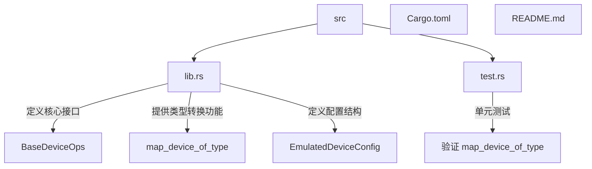
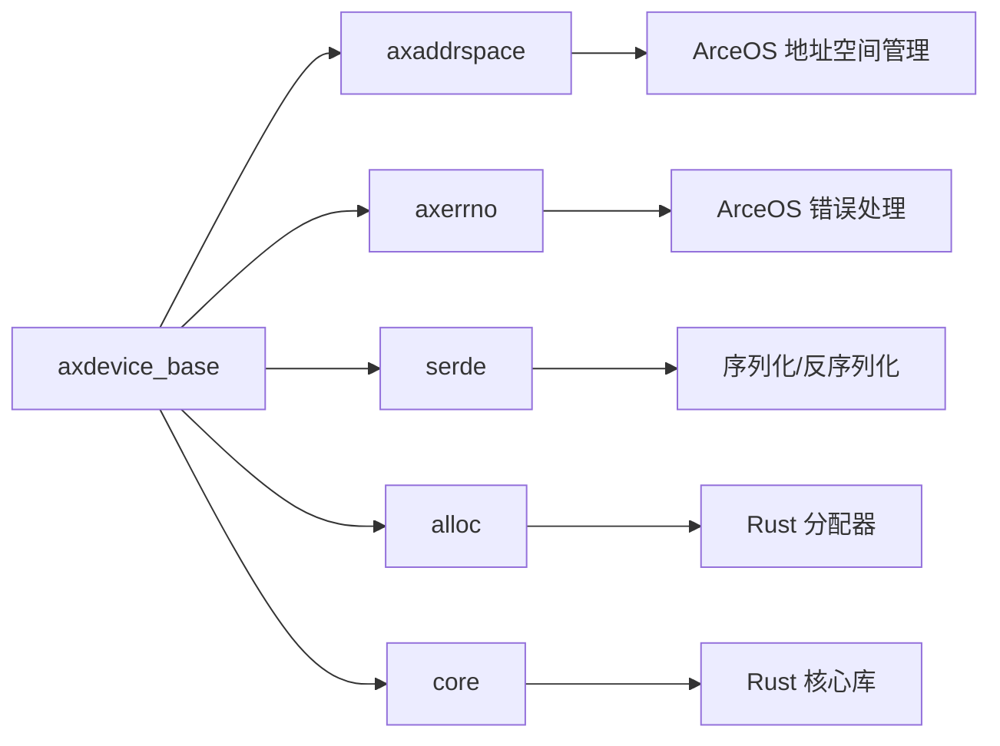

<cite>
**本文档中引用的文件**
- [lib.rs](file://src/lib.rs)
- [test.rs](file://src/test.rs)
</cite>

## 目录
1. [引言](#引言)
2. [项目结构](#项目结构)
3. [核心组件](#核心组件)
4. [架构概述](#架构概述)
5. [详细组件分析](#详细组件分析)
6. [依赖关系分析](#依赖关系分析)
7. [性能考量](#性能考量)
8. [故障排除指南](#故障排除指南)
9. [结论](#结论)

## 引言

本文档旨在深入解析 `axdevice_base` 库中的 `map_device_of_type` 函数，该函数是 ArceOS 虚拟化平台中用于设备类型安全转换的核心工具。通过利用 Rust 的 `Any` trait，此函数实现了在运行时对虚拟设备进行精确、安全的向下转型（downcast），从而允许访问特定设备类型的专有方法和配置。

文档将详细阐述其设计目的、实现机制、应用场景，并结合代码示例说明如何与 `BaseMmioDeviceOps` 等 trait 别名协同工作。同时，会强调其线程安全性与性能特征，并提供处理常见误用情况的最佳实践。

## 项目结构

`axdevice_base` 是一个精简的库，主要包含两个源文件：`lib.rs` 和 `test.rs`。其结构清晰，专注于为 ArceOS 超级管理程序提供基础的设备抽象。



**Diagram sources**
- [lib.rs](file://src/lib.rs#L1-L83)
- [test.rs](file://src/test.rs#L1-L75)

**Section sources**
- [lib.rs](file://src/lib.rs#L1-L83)
- [test.rs](file://src/test.rs#L1-L75)

## 核心组件

本节介绍构成 `axdevice_base` 库的几个关键组件。

### BaseDeviceOps Trait

`BaseDeviceOps` 是所有模拟设备必须实现的核心 trait。它定义了设备的基本行为，包括查询设备类型 (`emu_type`)、获取地址范围 (`address_range`) 以及处理读写操作 (`handle_read`, `handle_write`)。该 trait 继承自 `Any`，这是实现运行时类型检查的基础。

**Section sources**
- [lib.rs](file://src/lib.rs#L50-L58)

### EmulatedDeviceConfig 结构体

`EmulatedDeviceConfig` 结构体用于在虚拟机初始化时传递设备的配置信息，如名称、基地址、中断号等。

**Section sources**
- [lib.rs](file://src/lib.rs#L30-L42)

### map_device_of_type 函数

`map_device_of_type` 是本文档的核心，它是一个泛型函数，负责执行安全的类型转换。其设计目的是在不破坏类型安全的前提下，从一个通用的 `Arc<dyn BaseDeviceOps>` 接口实例中提取出具体的设备类型实例，并对其执行特定操作。

**Section sources**
- [lib.rs](file://src/lib.rs#L60-L70)

## 架构概述

`axdevice_base` 库的架构围绕着动态分发和运行时类型识别展开。

```mermaid
classDiagram
class BaseDeviceOps {
<<trait>>
+ emu_type() EmuDeviceType
+ address_range() R
+ handle_read(addr, width) AxResult~usize~
+ handle_write(addr, width, val) AxResult
}
class DeviceA {
- config : DeviceConfig
+ test_method() usize
}
class DeviceB {
- state : DeviceState
}
class BaseMmioDeviceOps {
<<trait alias>>
BaseDeviceOps<GuestPhysAddrRange>
}
class BaseSysRegDeviceOps {
<<trait alias>>
BaseDeviceOps<SysRegAddrRange>
}
BaseDeviceOps <|-- DeviceA : 实现
BaseDeviceOps <|-- DeviceB : 实现
BaseMmioDeviceOps .. BaseDeviceOps : 类型别名
BaseSysRegDeviceOps .. BaseDeviceOps : 类型别名
note right of BaseDeviceOps
继承自 Any trait，
支持运行时类型检查。
end note
note right of map_device_of_type
安全地将 Arc<dyn BaseDeviceOps>
向下转型为具体类型 T，
并在其上应用函数 f。
end note
```

**Diagram sources**
- [lib.rs](file://src/lib.rs#L50-L83)

## 详细组件分析

### map_device_of_type 函数的设计与实现

#### 设计目的

在虚拟化环境中，设备管理器通常持有大量实现了 `BaseDeviceOps` trait 的设备对象，这些对象被统一存储在 `Vec<Arc<dyn BaseDeviceOps>>` 这样的集合中。然而，某些高级操作或调试功能可能需要访问某个特定设备（如 `DeviceA`）独有的方法（如 `test_method`）。由于 trait 对象擦除了具体类型信息，直接调用这些特有方法是不可能的。

`map_device_of_type` 函数正是为了解决这一问题而设计。它的目标是在保持类型安全的同时，提供一种机制来“找回”被擦除的具体类型，从而能够调用那些非 trait 公开的方法。

#### 实现机制

该函数的实现巧妙地结合了 `Arc<dyn Any>` 和 `Any::downcast_ref` 方法：

1.  **类型擦除与重包装**：函数首先接收一个 `&Arc<dyn BaseDeviceOps<R>>` 类型的参数。由于 `BaseDeviceOps` 继承自 `Any`，这个 trait 对象可以被安全地转换为 `Arc<dyn Any>`。这一步完成了从特定 trait 对象到通用类型对象的转换。
2.  **运行时类型检查**：接着，函数调用 `any_arc.downcast_ref::<T>()`。`downcast_ref` 是 `Any` trait 提供的方法，它会检查内部存储的对象是否确实是类型 `T` 的实例。如果是，则返回一个 `Option<&T>`；如果不是，则返回 `None`。
3.  **函数应用与结果返回**：最后，使用 `Option::map` 方法，如果前一步成功获得了对 `T` 的引用，则立即将用户提供的闭包 `f` 应用于此引用，并返回闭包的执行结果（包装在 `Some(U)` 中）。如果类型不匹配，则整个表达式返回 `None`。

这种设计确保了：
- **安全性**：只有当类型完全匹配时，才会执行后续操作，避免了非法内存访问。
- **简洁性**：用户只需提供一个闭包，即可完成“检查-转换-调用”的整个流程。

**Section sources**
- [lib.rs](file://src/lib.rs#L60-L70)

### 应用场景与代码示例

#### 访问特定设备的配置或控制接口

假设有一个名为 `NetworkCard` 的设备，它除了实现 `BaseDeviceOps` 外，还提供了 `reset_statistics()` 和 `get_mac_address()` 等特有方法。当需要重置某张网卡的统计信息时，可以使用 `map_device_of_type`：

```rust
// 假设 device 是一个 Arc<dyn BaseDeviceOps<GuestPhysAddrRange>>
if let Some(()) = map_device_of_type(&device, |nic: &NetworkCard| nic.reset_statistics()) {
    println!("Network card statistics reset.");
} else {
    println!("The device is not a network card.");
}
```

#### 配合 BaseMmioDeviceOps 使用

`BaseMmioDeviceOps` 是一个 trait 别名，代表所有基于 MMIO 地址空间的设备。虽然 `map_device_of_type` 主要用于向下转型到具体结构体，但它同样适用于任何实现了 `BaseDeviceOps` 的类型。例如，可以先确认设备是 MMIO 设备，然后再尝试转换为更具体的类型。

```rust
// 此处 device 的类型为 &Arc<dyn BaseDeviceOps<GuestPhysAddrRange>>，
// 这正符合 BaseMmioDeviceOps 的约束。
let result = map_device_of_type::<dyn BaseMmioDeviceOps, _, _, _>(&device, |ops| {
    // 在 ops 上执行一些通用的 MMIO 操作
    ops.address_range()
});
```

尽管上述代码在技术上是可行的，但其实际意义有限，因为 `BaseMmioDeviceOps` 本身仍然是一个 trait 对象。`map_device_of_type` 的主要价值在于转换到像 `DeviceA` 或 `NetworkCard` 这样的具体类型。

**Section sources**
- [lib.rs](file://src/lib.rs#L73-L78)
- [test.rs](file://src/test.rs#L45-L55)

### 线程安全性与性能特征

#### 线程安全性

`map_device_of_type` 函数本身是线程安全的。它只接收一个不可变引用 `&Arc<dyn BaseDeviceOps<R>>`，并且 `Arc` 和 `Any` 的相关操作都是无副作用的读取操作。因此，可以在多线程环境中并发调用此函数来检查不同线程持有的设备对象，而不会引发数据竞争。

#### 性能特征

尽管 `map_device_of_type` 是安全的，但其性能开销不容忽视：
- **运行时开销**：`downcast_ref` 需要在运行时进行类型ID的比较，这比编译时的静态分发要慢。
- **频繁调用成本高**：如果在一个紧密的循环中反复调用此函数来检查同一设备，累积的性能损耗会非常显著。

**最佳实践**：应尽量避免在性能敏感的路径（如设备I/O处理循环）中频繁调用 `map_device_of_type`。理想的做法是在设备初始化或配置阶段一次性完成类型识别，并将结果缓存起来，后续直接使用缓存的强类型引用。

**Section sources**
- [lib.rs](file://src/lib.rs#L60-L70)

## 依赖关系分析

`axdevice_base` 库依赖于多个外部 crate 来构建其功能。



**Diagram sources**
- [Cargo.toml](file://Cargo.toml)
- [lib.rs](file://src/lib.rs#L10-L15)

**Section sources**
- [Cargo.toml](file://Cargo.toml)
- [lib.rs](file://src/lib.rs#L10-L15)

## 性能考量

如前所述，`map_device_of_type` 的主要性能瓶颈在于其运行时类型检查。开发者应意识到，每一次调用都伴随着一次哈希表查找或指针比较的开销。在高吞吐量的虚拟化I/O路径中，这种开销可能会成为性能瓶颈。

**优化建议**：
- **缓存转换结果**：一旦通过 `map_device_of_type` 成功识别出设备类型，应尽可能将得到的强类型引用（或一个标记该设备类型的枚举）保存下来，避免重复转换。
- **预分类设备列表**：在系统启动时，可以根据设备类型将 `BaseDeviceOps` 对象预先分类到不同的列表中。这样，在需要处理某一类设备时，可以直接遍历对应的列表，无需进行类型检查。

[本节不分析具体源文件，因此无需添加 Section sources]

## 故障排除指南

### 处理类型不匹配导致的 None 结果

最常见的问题是 `map_device_of_type` 返回 `None`。这通常意味着传入的设备对象并非期望的类型 `T`。

**解决方案**：
1.  **确认类型**：仔细检查你期望转换的目标类型 `T` 是否正确。例如，你是否试图将一个 `DeviceB` 实例转换为 `DeviceA`？
2.  **使用模式匹配**：始终使用 `if let Some(result) = ...` 或 `match` 表达式来优雅地处理 `None` 情况，而不是直接解包 `Option`，以防止 panic。
3.  **日志记录**：在 `else` 分支中添加日志，记录当前设备的实际类型（如果可能的话），有助于调试。

### 编写健壮的类型转换逻辑

结合 `Option` 模式，可以编写出非常健壮的代码：

```rust
fn process_device(device: &Arc<dyn BaseDeviceOps<GuestPhysAddrRange>>) {
    // 尝试作为 DeviceA 处理
    if let Some(answer) = map_device_of_type(device, |d: &DeviceA| d.test_method()) {
        println!("Got answer from DeviceA: {}", answer);
        return;
    }

    // 尝试作为 DeviceB 处理
    if let Some(()) = map_device_of_type(device, |d: &DeviceB| d.some_special_op()) {
        println!("DeviceB special op executed.");
        return;
    }

    // 默认处理
    println!("Unknown device type, handling generically.");
}
```

这种方法体现了“特质先行，类型后查”的设计哲学，既保证了灵活性，又不失安全性。

**Section sources**
- [test.rs](file://src/test.rs#L45-L55)

## 结论

`map_device_of_type` 函数是 `axdevice_base` 库中一个精巧的设计，它利用 Rust 的 `Any` trait 在动态分发的灵活性和静态类型的安危性之间取得了平衡。它使得开发者能够在需要时安全地访问特定设备的私有接口，极大地增强了框架的扩展能力。

然而，开发者必须牢记其性能成本，避免在关键路径上滥用。通过合理地缓存转换结果和预分类设备，可以最大限度地发挥其优势，同时规避其劣势。总体而言，这是一个在虚拟化设备管理领域非常实用且值得借鉴的设计模式。