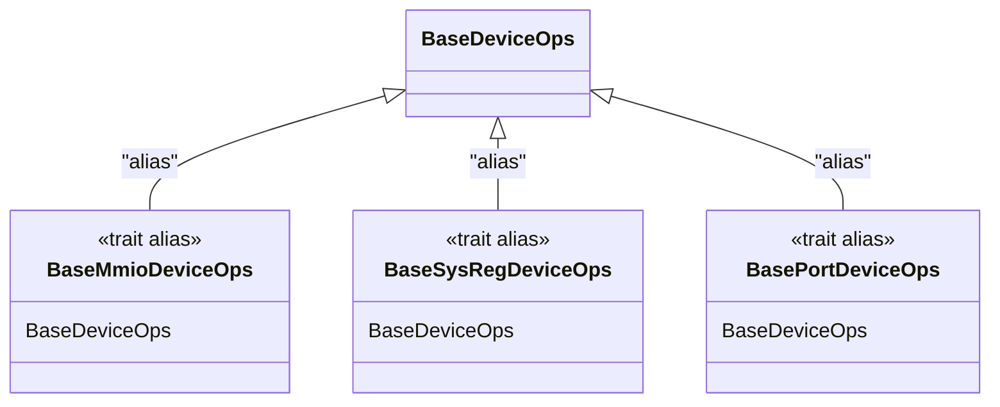
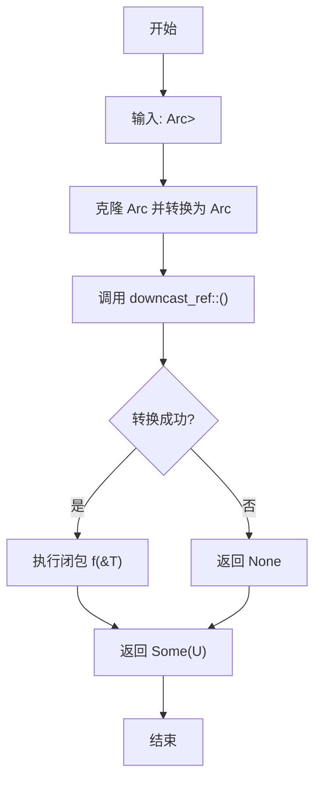
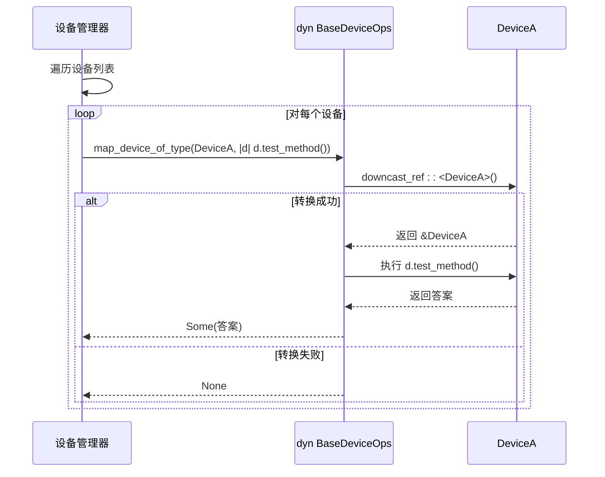

# 类型安全工具

<cite>
**本文档引用的文件**
- [lib.rs](file://src/lib.rs)
- [test.rs](file://src/test.rs)
</cite>

## 目录
1. [简介](#简介)
2. [核心组件分析](#核心组件分析)
3. [map_device_of_type 函数详解](#map_device_of_type-函数详解)
4. [典型应用场景](#典型应用场景)
5. [错误处理与健壮性](#错误处理与健壮性)
6. [设计权衡与对比](#设计权衡与对比)
7. [结论](#结论)

## 简介

本项目 `axdevice_base` 为 ArceOS 虚拟化环境中的模拟设备提供了一套基础的类型安全机制。其核心目标是实现一个安全、灵活且高效的运行时类型转换系统，允许在不牺牲内存安全的前提下，对实现了通用操作接口的设备进行特定类型的访问和操作。

该文档将深入剖析 `map_device_of_type` 这一关键函数的设计与实现。此函数作为类型转换的核心枢纽，利用 Rust 的 `Any` trait 和向下转型（downcast）机制，为设备管理系统提供了强大的动态类型查询与安全访问能力。通过泛型约束和闭包回调模式，它实现了对异构设备集合的安全遍历与特有功能调用，是构建可扩展虚拟设备框架的重要基石。

## 核心组件分析

### BaseDeviceOps 特质

`BaseDeviceOps` 是所有模拟设备必须实现的核心特质。它定义了设备的基本行为契约，包括查询设备类型、获取地址范围以及处理读写操作。

```mermaid
classDiagram
class BaseDeviceOps {
<<trait>>
+emu_type() EmuDeviceType
+address_range() R
+handle_read(addr : R : : Addr, width : AccessWidth) AxResult<usize>
+handle_write(addr : R : : Addr, width : AccessWidth, val : usize) AxResult
}
note right of BaseDeviceOps
泛型参数 R 必须实现 DeviceAddrRange
继承 Any trait 以支持运行时类型信息
end note
```

**Diagram sources**
- [lib.rs](file://src/lib.rs#L60-L80)

**Section sources**
- [lib.rs](file://src/lib.rs#L60-L80)

该特质的关键特性在于其同时继承了 `Any` trait。这一设计决策至关重要，它为所有实现了 `BaseDeviceOps` 的具体设备类型注入了运行时类型信息（RTTI），从而使得后续的 `downcast_ref` 操作成为可能。此外，通过关联类型 `R: DeviceAddrRange`，该特质能够灵活地适配不同寻址方式的设备，如 MMIO、端口 I/O 或系统寄存器。

### 设备类型别名

为了简化常用设备类型的声明，代码库定义了三个基于 `BaseDeviceOps` 的特质别名：



**Diagram sources**
- [lib.rs](file://src/lib.rs#L82-L90)

这些别名极大地提升了代码的可读性和易用性，开发者可以直接使用 `BaseMmioDeviceOps` 等名称，而无需每次都指定复杂的泛型参数。

## map_device_of_type 函数详解

`map_device_of_type` 函数是整个类型安全机制的核心，其实现精巧地结合了泛型、闭包和 `Any` trait 的特性。

### 函数签名与泛型约束

```rust
pub fn map_device_of_type<T: BaseDeviceOps<R>, R: DeviceAddrRange, U, F: FnOnce(&T) -> U>(
    device: &Arc<dyn BaseDeviceOps<R>>,
    f: F,
) -> Option<U>
```

该函数的泛型参数具有明确的约束：
- `T`: 目标具体设备类型，必须同时实现 `BaseDeviceOps<R>` 和 `Any` (由 `BaseDeviceOps` 继承)。
- `R`: 地址范围类型，用于确保 `T` 和输入的 `device` 使用相同的寻址方案。
- `U`: 闭包 `f` 的返回类型。
- `F`: 一个接受 `&T` 并返回 `U` 的一次性闭包。

这种设计确保了类型转换的上下文一致性，防止了跨寻址模式的非法转换。

### 执行流程分析



**Diagram sources**
- [lib.rs](file://src/lib.rs#L82-L90)

**Section sources**
- [lib.rs](file://src/lib.rs#L82-L90)

函数的执行流程如下：
1.  **类型擦除**: 输入的 `Arc<dyn BaseDeviceOps<R>>` 首先被克隆。由于 `BaseDeviceOps<R>` 继承自 `Any`，这个 `Arc` 可以被安全地向上转型（upcast）为 `Arc<dyn Any>`。这一步完成了从领域特定接口到通用 RTTI 接口的转换。
2.  **向下转型**: 在 `Arc<dyn Any>` 上调用 `downcast_ref::<T>()` 方法。这是一个安全的只读引用转换。如果底层对象的实际类型确实是 `T`，则返回 `Some(&T)`；否则返回 `None`。
3.  **闭包应用**: 利用 `Option` 的 `map` 方法，只有当 `downcast_ref` 成功时，才会将解包后的 `&T` 引用传递给用户提供的闭包 `f` 执行。
4.  **结果返回**: 最终返回一个 `Option<U>`，完美封装了转换成功与否的结果。

### 安全性保障

此函数的设计从根本上杜绝了不安全转换的风险：
- **无 `unsafe` 代码**: 整个过程完全依赖于 Rust 标准库中经过严格验证的 `Any` 和 `downcast_ref` 机制。
- **引用安全**: `downcast_ref` 返回的是一个共享引用 (`&T`)，保证了借用规则得到遵守，避免了悬垂指针或双重释放等问题。
- **原子性**: 由于使用了 `Arc`，对象的生命周期得到了自动管理，即使在多线程环境下也能保证安全。

## 典型应用场景

### 访问设备特有属性

最常见的场景是需要访问某个特定设备独有的方法或字段。例如，在测试代码中，`DeviceA` 定义了一个特有的 `test_method`。



**Diagram sources**
- [test.rs](file://src/test.rs#L50-L75)

**Section sources**
- [test.rs](file://src/test.rs#L50-L75)

如上图所示，设备管理器可以安全地尝试将一个通用设备引用转换为 `DeviceA`，并调用其专有的 `test_method`。对于 `DeviceB`，转换会失败并返回 `None`，管理器可以据此忽略或采取其他措施。

### 调试与诊断接口

在调试或监控系统中，此机制可用于动态探查设备状态。例如，一个调试命令可能需要检查所有设备中是否包含某种高性能计数器设备。通过 `map_device_of_type`，可以安全地尝试转换并读取其内部计数器值，而不会影响其他类型设备的正常运行。

## 错误处理与健壮性

`map_device_of_type` 函数返回 `Option<U>` 的设计是其健壮性的关键体现。

- **优雅降级**: 当类型不匹配时，函数返回 `None`，而不是 panic 或返回一个无效值。这迫使调用者必须显式处理“未找到”或“类型不符”的情况，从而编写出更可靠的代码。
- **组合性**: `Option` 类型天然支持链式调用和模式匹配，使得错误处理逻辑简洁明了。例如，可以轻松地使用 `if let Some(result) = ... { /* 处理成功 */ }` 或 `match` 表达式来分支处理。
- **零成本抽象**: 在编译期，`Option` 的存在通常会被优化掉，不会引入额外的运行时开销。

## 设计权衡与对比

### 与枚举包装方案对比

一种替代方案是使用 `enum` 来包装所有可能的设备类型：

```rust
enum Device {
    DeviceA(Arc<DeviceA>),
    DeviceB(Arc<DeviceB>),
    // ...
}
```

**对比分析**:
- **灵活性**: `map_device_of_type` 方案更优。添加新设备类型时，无需修改 `enum` 定义，符合开闭原则。而枚举方案需要修改中心化的 `enum`，破坏了模块化。
- **安全性**: 两者都安全。但枚举方案在 `match` 语句中能强制要求处理所有情况，而 `Option` 方案依赖程序员主动处理 `None`。
- **性能**: 枚举方案在 `match` 时是 O(1) 的直接跳转，理论上更快。`map_device_of_type` 的 `downcast_ref` 需要进行类型ID比较，通常是 O(1) 但常数因子可能更大。

### 与虚函数扩展方案对比

另一种方案是在 `BaseDeviceOps` 中添加大量虚函数来覆盖所有子类的特有功能。

**对比分析**:
- **接口污染**: 虚函数方案会导致基类接口膨胀，违反单一职责原则。`map_device_of_type` 将特有功能保留在具体类中，保持了接口的纯净。
- **耦合度**: 虚函数方案使基类与所有子类的具体实现强耦合。`map_device_of_type` 方案则完全解耦，基类无需知晓任何子类细节。
- **维护性**: `map_device_of_type` 方案更易于维护和扩展。

综上所述，`map_device_of_type` 的设计在**灵活性**和**安全性**之间取得了极佳的平衡，特别适合于插件化、模块化的设备管理系统，尽管在极端性能敏感的场景下，枚举方案可能更具优势。

## 结论

`map_device_of_type` 函数是 `axdevice_base` 库中一个设计精妙的类型安全工具。它巧妙地利用了 Rust 的 `Any` trait 和泛型系统，提供了一种安全、灵活且易于使用的运行时类型转换机制。通过严格的泛型约束和 `Option` 返回类型，它不仅有效防止了不安全的转换，还促进了健壮的错误处理实践。相较于枚举包装或虚函数扩展等传统方案，该设计在保持低耦合和高内聚的同时，极大地提升了系统的可扩展性。此模式为构建复杂、可维护的虚拟化设备框架提供了一个优秀的范例。