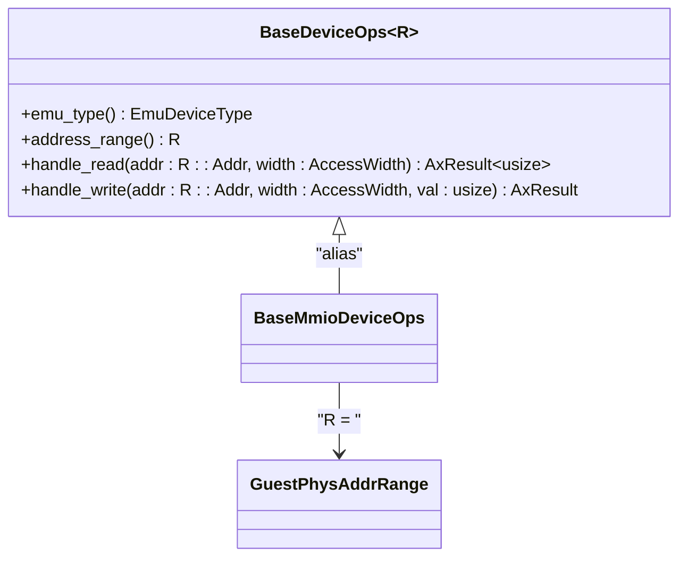
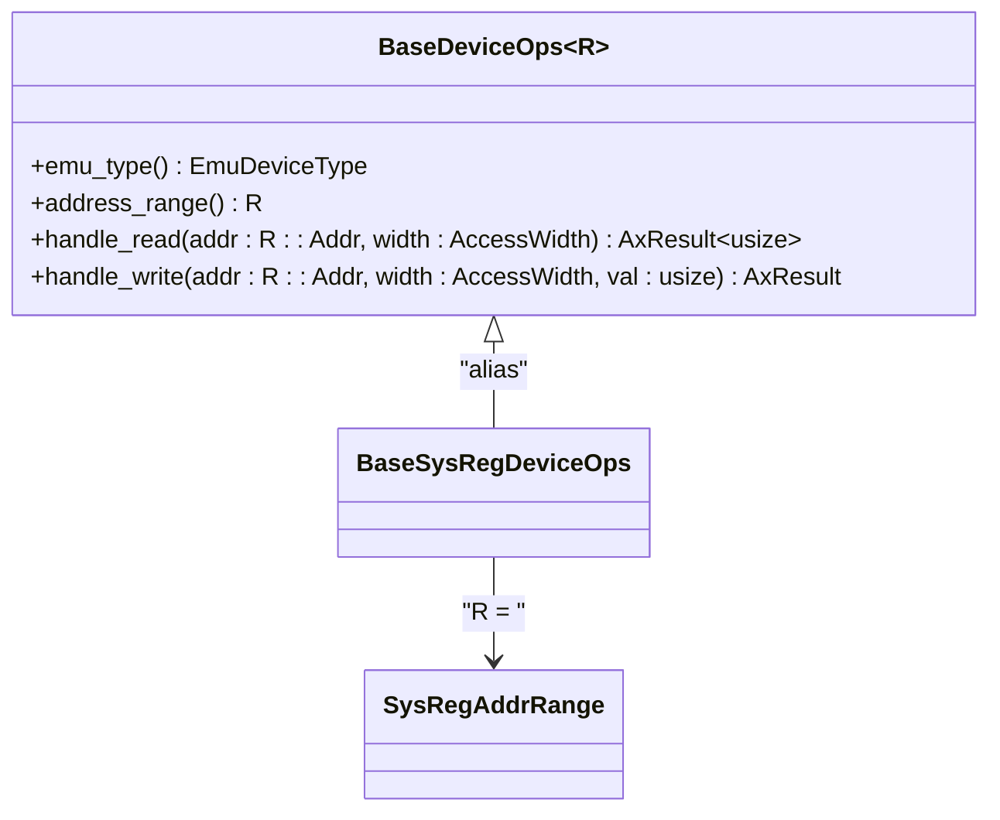
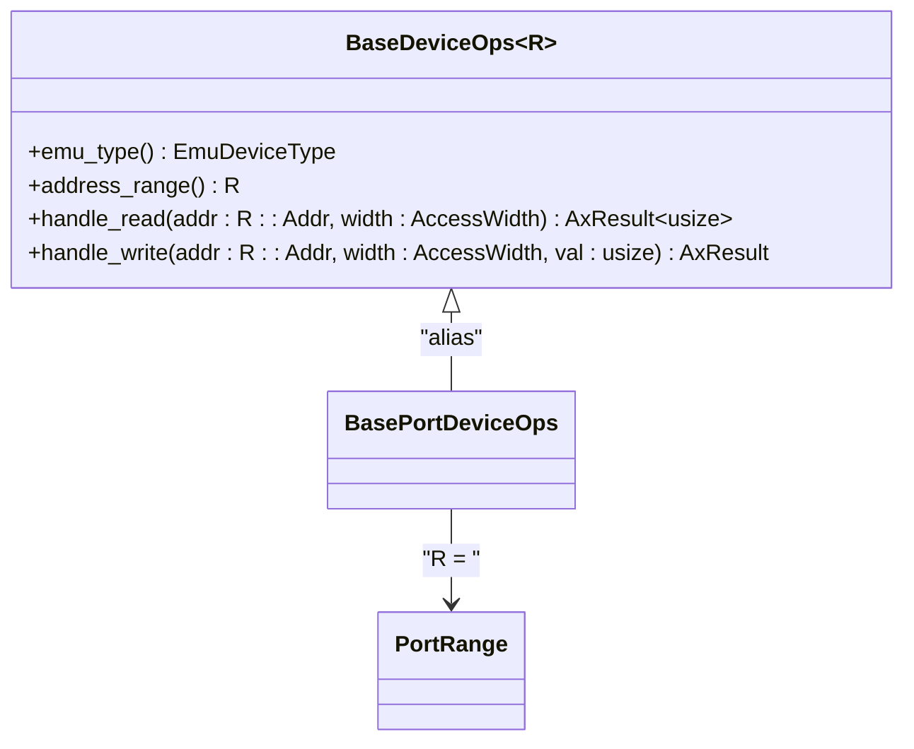
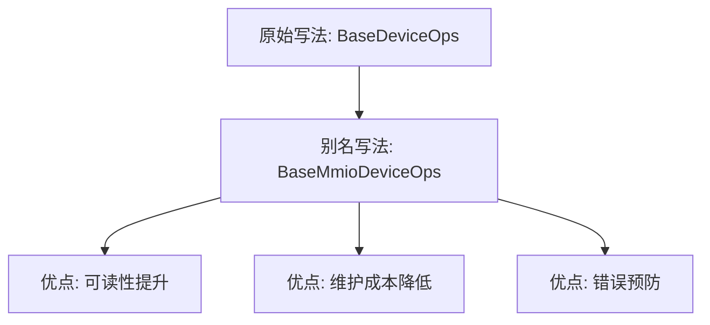

# 设备类型别名

<cite>
**本文档引用的文件**  
- [lib.rs](file://src/lib.rs)
</cite>

## 目录
1. [引言](#引言)
2. [Rust中的Trait别名语言特性](#rust中的trait别名语言特性)
3. [BaseMmioDeviceOps详解](#basemmiodeviceops详解)
4. [BaseSysRegDeviceOps详解](#basesysregdeviceops详解)
5. [BasePortDeviceOps详解](#baseportdeviceops详解)
6. [实际使用示例](#实际使用示例)
7. [维护优势分析](#维护优势分析)
8. [局限性与注意事项](#局限性与注意事项)
9. [结论](#结论)

## 引言

在ArceOS虚拟化平台中，`axdevice_base`库为模拟设备提供了基础的抽象接口。该库通过引入三个关键的trait别名——`BaseMmioDeviceOps`、`BaseSysRegDeviceOps`和`BasePortDeviceOps`，显著提升了代码的可读性和可维护性。这些别名基于通用的`BaseDeviceOps<R>` trait，并针对不同类型的设备地址空间进行了特化。

**Section sources**
- [lib.rs](file://src/lib.rs#L1-L83)

## Rust中的Trait别名语言特性

Trait别名是Rust语言的一项高级特性（需启用`#![feature(trait_alias)]`），它允许开发者为一个或多个trait组合创建新的名称。其语法形式为：

```rust
pub trait AliasName = TraitWithGenerics<TypeParameter>;
```

在此项目中，trait别名的主要价值体现在：
- **简化复杂泛型表达式**：将冗长的`BaseDeviceOps<GuestPhysAddrRange>`简化为更具语义的`BaseMmioDeviceOps`
- **提高代码可读性**：使函数签名和类型注解更直观地反映设备类型
- **增强类型安全性**：通过专用别名明确区分不同类型的设备操作

尽管该特性仍在发展（如RFC 3437所述），但在本项目中已被有效利用来组织设备抽象层。

**Section sources**
- [lib.rs](file://src/lib.rs#L20-L21)

## BaseMmioDeviceOps详解

`BaseMmioDeviceOps`是专用于内存映射I/O（MMIO）设备的trait别名。它等价于`BaseDeviceOps<GuestPhysAddrRange>`，其中`GuestPhysAddrRange`表示客户机物理地址范围。

此别名适用于处理通过内存地址访问的硬件设备，如PCI设备、串口控制器等。使用该别名可以清晰表明实现者是一个MMIO设备驱动，而非其他类型的设备。



**Diagram sources**
- [lib.rs](file://src/lib.rs#L65-L67)

**Section sources**
- [lib.rs](file://src/lib.rs#L65-L67)

## BaseSysRegDeviceOps详解

`BaseSysRegDeviceOps`是专用于系统寄存器设备的trait别名。它等价于`BaseDeviceOps<SysRegAddrRange>`，其中`SysRegAddrRange`表示系统寄存器地址范围。

此类设备通常涉及CPU架构特定的寄存器访问，如ARM系统控制寄存器或x86 MSR（Model Specific Registers）。通过使用此别名，代码能够明确区分普通MMIO设备与系统级寄存器设备。



**Diagram sources**
- [lib.rs](file://src/lib.rs#L68-L70)

**Section sources**
- [lib.rs](file://src/lib.rs#L68-L70)

## BasePortDeviceOps详解

`BasePortDeviceOps`是专用于端口I/O设备的trait别名。它等价于`BaseDeviceOps<PortRange>`，其中`PortRange`表示I/O端口地址范围。

这种设备类型常见于传统PC架构中的ISA设备，如键盘控制器、软盘控制器等。使用此别名有助于在代码中清晰标识出基于端口I/O的设备实现。



**Diagram sources**
- [lib.rs](file://src/lib.rs#L71-L73)

**Section sources**
- [lib.rs](file://src/lib.rs#L71-L73)

## 实际使用示例

### 函数签名中的应用
```rust
fn register_mmio_device(device: Arc<dyn BaseMmioDeviceOps>) -> AxResult {
    // 注册MMIO设备逻辑
}
```

### 特征边界中的应用
```rust
impl<T: BaseSysRegDeviceOps> SomeTrait for T {
    // 仅适用于系统寄存器设备的实现
}
```

### 类型注解中的便捷性
相比直接书写`Arc<dyn BaseDeviceOps<GuestPhysAddrRange>>`，使用`Arc<dyn BaseMmioDeviceOps>`不仅缩短了类型名称，而且增强了语义表达能力。

**Section sources**
- [lib.rs](file://src/lib.rs#L65-L73)

## 维护优势分析

使用trait别名带来了显著的维护优势：

### 重构传播效应
当需要修改底层`BaseDeviceOps<R>`的定义时，所有通过别名引用的地方会自动继承变更，无需逐个文件修改复杂的泛型参数。

### 接口一致性
确保所有MMIO设备统一使用相同的地址范围类型（`GuestPhysAddrRange`），避免因手动指定泛型参数而导致的不一致。

### 抽象层次提升
将技术细节（泛型参数）封装在别名内部，使上层代码专注于业务逻辑而非类型系统细节。



**Diagram sources**
- [lib.rs](file://src/lib.rs#L65-L73)

**Section sources**
- [lib.rs](file://src/lib.rs#L65-L73)

## 局限性与注意事项

尽管trait别名提供了诸多便利，但也存在一些重要限制：

### 无法添加新方法
trait别名不能扩展原trait的功能，即不能为其添加新的方法或覆盖默认实现。它们仅仅是类型的同义词。

### 兼容性约束
由于依赖不稳定特性（`#![feature(trait_alias)]`），跨项目复用时需确保编译器版本兼容。

### 调试复杂度
在调试或阅读错误信息时，编译器可能会展开别名为原始泛型形式，增加理解难度。

### 文档生成挑战
部分文档工具可能无法正确解析trait别名的关联项，导致API文档不够完整。

**Section sources**
- [lib.rs](file://src/lib.rs#L20-L21)

## 结论

`BaseMmioDeviceOps`、`BaseSysRegDeviceOps`和`BasePortDeviceOps`这三个trait别名在`axdevice_base`库中发挥了重要作用。它们不仅简化了代码书写，更重要的是提升了类型系统的语义表达能力，使得不同类型的设备操作在类型层面就得以清晰区分。

通过合理运用Rust的trait alias特性，该项目实现了更好的代码组织结构和更高的可维护性。然而，开发者也应意识到该特性的当前局限性，在享受便利的同时注意潜在的风险。

未来随着Rust语言对trait alias特性的进一步完善（如RFC 3437的推进），这类抽象模式有望在更多系统编程项目中得到广泛应用。