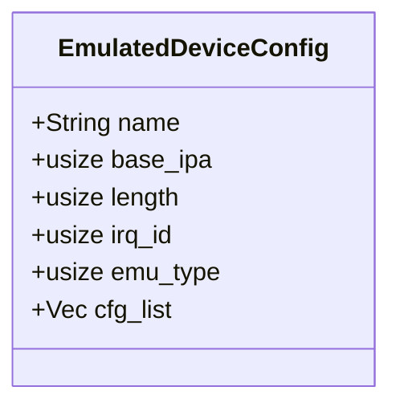
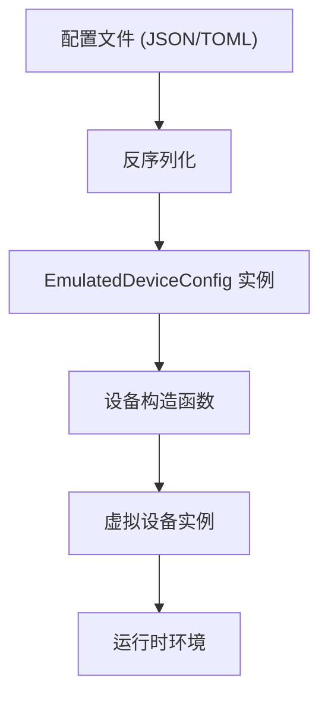
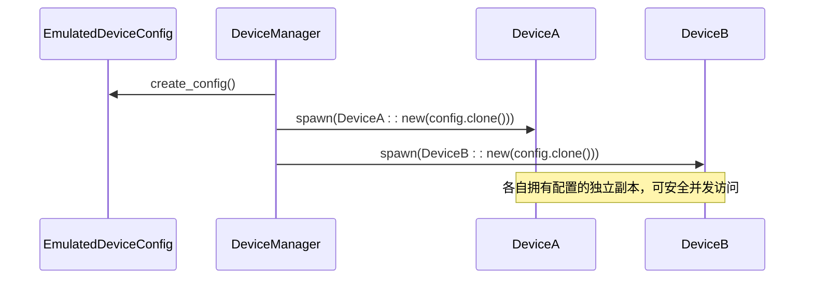

# 设备配置管理

<cite>
**本文档引用的文件**
- [lib.rs](file://src\lib.rs)
- [Cargo.toml](file://Cargo.toml)
- [README.md](file://README.md)
</cite>

## 目录
1. [简介](#简介)
2. [核心结构体定义](#核心结构体定义)
3. [字段详解](#字段详解)
4. [序列化与反序列化](#序列化与反序列化)
5. [配置验证机制](#配置验证机制)
6. [不可变性与并发访问](#不可变性与并发访问)
7. [常见配置错误诊断](#常见配置错误诊断)
8. [完整配置示例](#完整配置示例)

## 简介

`EmulatedDeviceConfig` 结构体是 ArceOS 虚拟机监控器中设备实例化和配置传递的核心数据载体。它为虚拟设备的初始化提供了统一的配置接口，封装了设备的基本属性和运行参数。该结构体设计用于 `no_std` 环境，是构建可扩展、类型安全的虚拟设备系统的基础组件。

**Section sources**
- [lib.rs](file://src\lib.rs#L0-L83)
- [README.md](file://README.md#L0-L45)

## 核心结构体定义

`EmulatedDeviceConfig` 是一个公开的 Rust 结构体，位于 `axdevice_base` crate 的 `lib.rs` 文件中。它实现了 `Debug`、`Default`、`Clone` 以及通过 Serde 派生的 `Serialize` 和 `Deserialize` 特性，使其便于调试、复制和跨格式的数据交换。



**Diagram sources**
- [lib.rs](file://src\lib.rs#L36-L70)

**Section sources**
- [lib.rs](file://src\lib.rs#L36-L70)

## 字段详解

`EmulatedDeviceConfig` 结构体包含六个公共字段，每个字段都有其特定的用途和语义：

### name
- **用途**: 设备的唯一标识名称。
- **数据类型**: `String`
- **有效取值范围**: 非空字符串，通常遵循命名约定（如小写字母、数字和连字符）。
- **关系**: 用于日志记录、调试和在设备管理器中查找特定设备。

### base_ipa
- **用途**: 设备的中间物理地址（IPA）基址，用于内存映射I/O（MMIO）或端口I/O的寻址。
- **数据类型**: `usize`
- **有效取值范围**: 有效的物理地址，通常需要对齐到设备长度，并且不能与其他设备的地址空间重叠。
- **关系**: 与 `length` 字段共同定义了设备的地址范围。

### length
- **用途**: 设备占用的地址空间长度（以字节为单位）。
- **数据类型**: `usize`
- **有效取值范围**: 大于零的正整数，通常为2的幂次方（如4KB, 64KB）。
- **关系**: 必须与 `base_ipa` 结合使用，确保地址范围不越界且无重叠。

### irq_id
- **用途**: 设备关联的中断请求（IRQ）ID，用于向虚拟CPU发送中断信号。
- **数据类型**: `usize`
- **有效取值范围**: 由虚拟机平台定义的有效中断号，通常是一个非负整数。
- **关系**: 在中断控制器配置中作为索引使用。

### emu_type
- **用途**: 表示模拟设备的类型，用于区分不同种类的设备（如网络、存储、串口等）。
- **数据类型**: `usize`
- **有效取值范围**: 对应于 `EmuDeviceType` 枚举的内部表示。虽然此处为 `usize`，但实际值应来自 `axvmconfig` crate 中定义的枚举。
- **关系**: 决定了设备的行为模式和所实现的 `BaseDeviceOps` 特性。

### cfg_list
- **用途**: 一个灵活的配置列表，用于存储特定设备类型的额外参数。
- **数据类型**: `Vec<usize>`
- **有效取值范围**: 一系列 `usize` 值，其解释完全依赖于具体的 `emu_type`。
- **关系**: 提供了一种扩展机制，允许在不修改核心结构体的情况下为新设备类型添加自定义配置。

**Section sources**
- [lib.rs](file://src\lib.rs#L36-L70)

## 序列化与反序列化

`EmulatedDeviceConfig` 结构体通过 Serde 库的派生宏实现了序列化和反序列化功能。这使得配置可以轻松地从 JSON、TOML 或其他支持的格式加载和保存。

### 实现方式
- **派生宏**: 在结构体定义上使用 `#[derive(serde::Serialize, serde::Deserialize)]` 宏。
- **依赖项**: `Cargo.toml` 文件中明确声明了 `serde` 依赖，并启用了 `derive` 和 `alloc` 特性，以适应 `no_std` 环境。

### 使用场景
此功能允许用户通过外部配置文件（如 `config.json` 或 `device.toml`）来定义虚拟设备，极大地提高了系统的灵活性和可配置性。



**Diagram sources**
- [lib.rs](file://src\lib.rs#L36-L70)
- [Cargo.toml](file://Cargo.toml#L0-L18)

**Section sources**
- [lib.rs](file://src\lib.rs#L36-L70)
- [Cargo.toml](file://Cargo.toml#L0-L18)

## 配置验证机制

根据当前代码库分析，`EmulatedDeviceConfig` 结构体本身**不包含内置的配置验证逻辑**。

### 责任归属
- **延迟验证**: 配置的验证责任被推迟到了使用该配置的更高层组件或具体设备的构造函数中。例如，当一个设备实现 `BaseDeviceOps` 特性时，它会在 `address_range()` 方法中根据 `base_ipa` 和 `length` 创建 `GuestPhysAddrRange`，这个过程可能会进行边界检查和对齐验证。
- **缺乏即时校验**: 结构体的 `new` 或 `default` 方法没有执行任何校验，这意味着一个 `EmulatedDeviceConfig` 实例可能包含无效或冲突的值（如 `length=0` 或 `base_ipa` 重叠），直到它被实际使用时才会暴露问题。

### 验证建议
为了提高健壮性，建议在创建设备实例之前，在设备管理器或虚拟机配置解析阶段增加一个显式的验证步骤。

**Section sources**
- [lib.rs](file://src\lib.rs#L36-L70)
- [test.rs](file://src\test.rs#L0-L75)

## 不可变性与并发访问

`EmulatedDeviceConfig` 结构体的设计体现了**配置数据的不可变性原则**。

### 设计体现
- **克隆而非修改**: 结构体实现了 `Clone` 特性，鼓励通过克隆来创建新的配置实例，而不是就地修改现有实例。
- **所有权转移**: 配置通常在设备创建时作为参数传递，并将所有权转移给新创建的设备对象。

### 并发影响
这种设计非常适合并发环境：
1. **线程安全**: 一旦配置被创建并传递给设备，它通常被视为只读数据。
2. **减少锁竞争**: 由于配置不会被修改，因此不需要在多个线程间共享可变状态，从而避免了复杂的锁机制。
3. **Arc 包装**: 如果需要在多个组件间共享配置，可以使用 `Arc<EmulatedDeviceConfig>` 来实现高效的只读共享。



**Diagram sources**
- [lib.rs](file://src\lib.rs#L36-L70)
- [test.rs](file://src\test.rs#L0-L75)

**Section sources**
- [lib.rs](file://src\lib.rs#L36-L70)
- [test.rs](file://src\test.rs#L0-L75)

## 常见配置错误诊断

尽管验证是延迟的，但以下是一些常见的配置错误及其诊断方法：

### 地址重叠 (Address Overlap)
- **症状**: 设备行为异常，一个设备的读写操作影响了另一个设备。
- **诊断**: 在创建所有设备后，遍历它们的 `address_range()` 并检查是否有交集。
- **修复**: 调整 `base_ipa` 或 `length` 字段，确保所有设备的地址空间互不重叠。

### 无效中断ID (Invalid IRQ ID)
- **症状**: 设备无法触发中断，或导致虚拟机崩溃。
- **诊断**: 检查 `irq_id` 是否超出了虚拟中断控制器支持的范围。
- **修复**: 参考虚拟机平台文档，选择一个有效的、未被占用的中断号。

### 长度为零 (Zero Length)
- **症状**: 在尝试创建 `GuestPhysAddrRange` 时发生 panic 或返回错误。
- **诊断**: 在设备构造函数中检查 `length` 字段是否大于零。
- **修复**: 将 `length` 设置为一个合理的正值。

**Section sources**
- [lib.rs](file://src\lib.rs#L36-L70)

## 完整配置示例

以下是一个如何构建和使用 `EmulatedDeviceConfig` 的示例：

```rust
// 创建一个默认配置并进行定制
let mut config = EmulatedDeviceConfig::default();
config.name = "serial_port_0".to_string();
config.base_ipa = 0x9000_0000;
config.length = 0x1000; // 4KB
config.irq_id = 32;
config.emu_type = EmuDeviceType::Serial as usize;
config.cfg_list = vec![115200]; // 波特率

// 将此配置传递给一个假想的串口设备构造函数
// let serial_device = SerialDevice::new(config);
```

此示例展示了如何填充所有字段，并利用 `cfg_list` 来传递设备特定的参数（在此例中为波特率）。

**Section sources**
- [lib.rs](file://src\lib.rs#L36-L70)