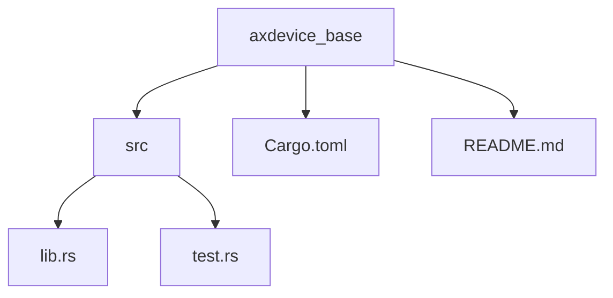
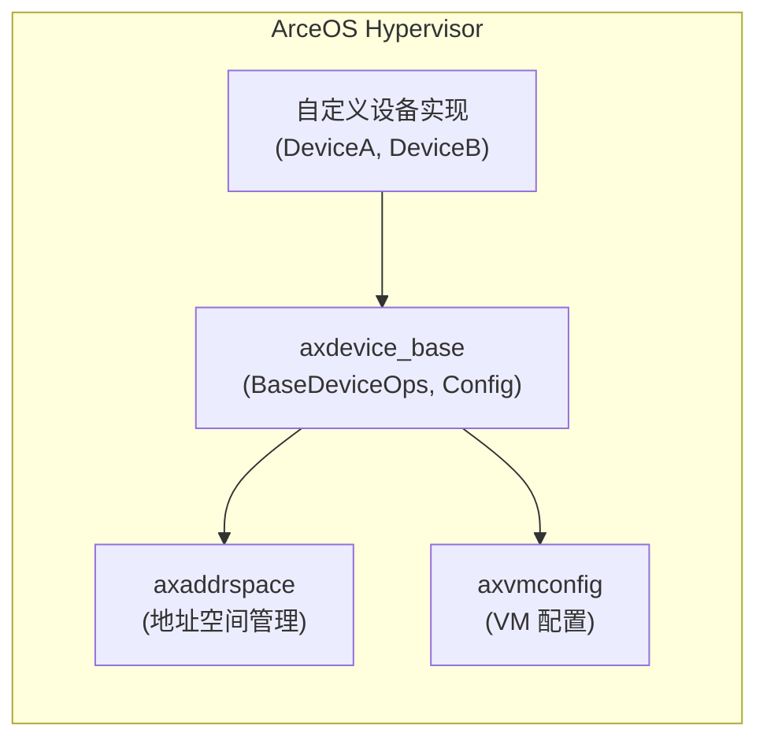

# 项目概述

<cite>
**Referenced Files in This Document**  
- [README.md](file://README.md)
- [Cargo.toml](file://Cargo.toml)
- [src/lib.rs](file://src/lib.rs)
- [src/test.rs](file://src/test.rs)
</cite>

## 目录
1. [简介](#简介)
2. [项目结构](#项目结构)
3. [核心组件](#核心组件)
4. [架构角色与集成](#架构角色与集成)
5. [技术栈分析](#技术栈分析)
6. [使用示例与开发指南](#使用示例与开发指南)
7. [常见误区与最佳实践](#常见误区与最佳实践)
8. [结论](#结论)

## 简介

`axdevice_base` 是 ArceOS 虚拟化平台中设备模拟子系统的基础抽象库，专为 `no_std` 环境设计。该项目旨在为 Rust 编写的虚拟设备提供统一的接口和类型安全的数据结构，是构建高效、安全虚拟设备的核心基石。

其主要目标是定义一套通用的抽象，使得不同类型的虚拟设备（如 MMIO 设备、端口 I/O 设备、系统寄存器设备）能够遵循一致的设计模式进行开发。通过提供核心 trait 和配置结构，`axdevice_base` 极大地简化了新虚拟设备的实现过程，并确保了整个虚拟化平台中设备管理的一致性和可维护性。

该项目采用多重开源许可证（GPL-3.0-or-later, Apache-2.0, MulanPSL-2.0），允许使用者根据自身需求选择最合适的许可协议。

**Section sources**
- [README.md](file://README.md#L1-L45)
- [Cargo.toml](file://Cargo.toml#L1-L18)

## 项目结构

`axdevice_base` 项目的结构简洁明了，体现了其作为基础库的定位。

```
.
├── src
│   ├── lib.rs          # 核心功能的实现
│   └── test.rs         # 单元测试代码
├── Cargo.toml          # 项目元数据和依赖声明
└── README.md           # 项目说明文档
```

- **`src/lib.rs`**: 项目的主源文件，包含了所有公开的 trait、结构体和函数。
- **`src/test.rs`**: 包含了用于验证核心功能正确性的单元测试。
- **`Cargo.toml`**: 定义了项目名称、版本、作者信息以及关键的外部依赖。
- **`README.md`**: 提供了项目的概览、使用示例和贡献指南。

这种扁平化的结构非常适合一个专注于提供 API 的基础库。

**Diagram sources**
- [src/lib.rs](file://src/lib.rs#L1-L83)
- [src/test.rs](file://src/test.rs#L1-L75)



## 核心组件

`axdevice_base` 的核心由几个关键组件构成，它们共同定义了虚拟设备的编程模型。

### BaseDeviceOps Trait

`BaseDeviceOps` 是整个库的核心 trait，所有虚拟设备都必须实现此 trait。它是一个泛型 trait，其类型参数 `R` 必须满足 `DeviceAddrRange` 约束，这使得它可以灵活地适配不同类型的地址空间。

该 trait 定义了四个基本方法：
- `emu_type`: 返回设备的类型枚举。
- `address_range`: 返回设备所占用的地址范围。
- `handle_read`: 处理对该设备的读取操作。
- `handle_write`: 处理对该设备的写入操作。

通过将 `Any` 作为超类（supertrait），`BaseDeviceOps` 支持运行时类型识别，这对于后续的动态分发至关重要。

**Section sources**
- [src/lib.rs](file://src/lib.rs#L59-L72)

### EmulatedDeviceConfig 结构体

`EmulatedDeviceConfig` 是一个用于初始化虚拟设备的配置结构体。它通过 serde 库实现了序列化和反序列化功能，便于从外部配置文件或数据流中加载设备配置。

该结构体包含设备的名称、基地址（IPA）、长度、中断请求号（IRQ ID）、设备类型和配置列表等基本信息，为设备的创建提供了标准化的输入。

**Section sources**
- [src/lib.rs](file://src/lib.rs#L47-L57)

### 设备类型别名

为了方便开发者针对特定类型的设备进行编程，`axdevice_base` 提供了三个 trait 别名：
- `BaseMmioDeviceOps`: 针对内存映射 I/O (MMIO) 设备，使用 `GuestPhysAddrRange` 作为地址范围。
- `BaseSysRegDeviceOps`: 针对系统寄存器设备，使用 `SysRegAddrRange` 作为地址范围。
- `BasePortDeviceOps`: 针对端口 I/O 设备，使用 `PortRange` 作为地址范围。

这些别名极大地提升了代码的可读性和易用性。

**Section sources**
- [src/lib.rs](file://src/lib.rs#L74-L82)

### map_device_of_type 函数

`map_device_of_type` 是一个辅助函数，利用了 Rust 的 `Any` 特性和 trait 对象的 downcast 机制。它允许在持有 `Arc<dyn BaseDeviceOps<R>>` 这种不透明指针的情况下，安全地检查其底层的具体类型，并调用该具体类型独有的方法。

这个函数是实现“开闭原则”和插件式架构的关键，使得上层逻辑可以在不了解具体设备实现细节的情况下，与特定类型的设备进行交互。

**Section sources**
- [src/lib.rs](file://src/lib.rs#L74-L82)

## 架构角色与集成

`axdevice_base` 在 ArceOS 虚拟化平台的架构中扮演着承上启下的关键角色。



**Diagram sources**
- [src/lib.rs](file://src/lib.rs#L1-L83)
- [Cargo.toml](file://Cargo.toml#L1-L18)

### 与 axaddrspace 的协同

`axdevice_base` 重度依赖 `axaddrspace` crate 来处理地址空间相关的概念。`GuestPhysAddrRange`、`PortRange` 和 `AccessWidth` 等关键类型均来自 `axaddrspace`。这表明 `axdevice_base` 并不直接管理物理内存或地址转换，而是作为一个抽象层，将设备的地址范围和访问操作委托给专门负责地址空间管理的模块。

### 与 axvmconfig 的集成

`axdevice_base` 通过 `pub use axvmconfig::EmulatedDeviceType as EmuDeviceType;` 将设备类型枚举从 `axvmconfig` crate 重新导出。这建立了一种清晰的职责划分：`axvmconfig` 负责定义虚拟机的整体配置和设备分类，而 `axdevice_base` 则负责定义这些设备的行为规范。两者结合，形成了完整的设备配置与行为模型。

## 技术栈分析

`axdevice_base` 充分利用了现代 Rust 语言的高级特性来构建一个既安全又高效的抽象。

### Rust 语言特性

- **Trait 对象与动态分发**: `BaseDeviceOps` 被设计为一个 trait 对象 (`dyn BaseDeviceOps`)，这允许多个不同类型的设备被统一存储和管理（例如，在一个 `Vec<Arc<dyn BaseDeviceOps>>` 中）。当调用 `handle_read` 或 `handle_write` 时，会通过虚函数表进行动态分发，执行具体设备的实现。
- **泛型约束**: `BaseDeviceOps<R: DeviceAddrRange>` 使用泛型来适应不同的地址空间类型，同时通过 `R::Addr` 关联类型确保了地址参数的类型安全。
- **Any 类型与运行时检查**: 继承 `Any` trait 使得 `map_device_of_type` 成为可能，它通过 `downcast_ref` 在运行时安全地将 `dyn BaseDeviceOps` 转换回具体的设备类型，从而访问其私有方法。

### no_std 环境适配

`#![no_std]` 属性表明该项目不依赖于标准库，这对于运行在 hypervisor 等资源受限环境中的代码至关重要。项目通过显式引入 `alloc` crate 来使用堆分配（如 `String`, `Vec`, `Arc`），在避免标准库的同时保留了必要的动态数据结构支持。

### Serde 序列化

`serde` 库的使用（配合 `derive` 和 `alloc` 特性）使得 `EmulatedDeviceConfig` 可以轻松地在不同格式（如 JSON、Bincode）之间进行序列化和反序列化，极大地便利了设备配置的持久化和跨组件传递。

**Section sources**
- [src/lib.rs](file://src/lib.rs#L1-L83)
- [Cargo.toml](file://Cargo.toml#L1-L18)

## 使用示例与开发指南

### 典型使用场景

根据 `README.md` 和 `test.rs` 中的示例，创建一个新虚拟设备的标准流程如下：

1.  **定义设备结构体**: 创建一个表示你设备的 struct。
2.  **实现 BaseDeviceOps**: 为你的 struct 实现 `BaseDeviceOps` trait，填充 `emu_type`、`address_range`、`handle_read` 和 `handle_write` 方法的逻辑。
3.  **创建配置**: 使用 `EmulatedDeviceConfig` 来描述你的设备实例。
4.  **集成与管理**: 将你的设备实例包装在 `Arc<dyn BaseDeviceOps<...>>` 中，以便与其他设备一起被统一管理。

`test.rs` 文件中的 `DeviceA` 和 `DeviceB` 是完美的参考实现。

### 开发者集成步骤

1.  在你的 `Cargo.toml` 中添加 `axdevice_base` 作为依赖。
2.  导入所需的 trait 和结构体：`use axdevice_base::{BaseDeviceOps, EmulatedDeviceConfig};`。
3.  按照上述流程实现你的设备。
4.  利用 `map_device_of_type` 函数在需要时与特定设备进行深度交互。

**Section sources**
- [README.md](file://README.md#L25-L35)
- [src/test.rs](file://src/test.rs#L1-L75)

## 常见误区与最佳实践

### 正确实现 BaseDeviceOps

- **误区**: 忽略 `handle_read`/`handle_write` 的返回值。这些方法返回 `AxResult`，必须正确处理错误情况（如越界访问、无效宽度）。
- **最佳实践**: 在 `handle_read` 中，对于未实现的寄存器，应返回一个明确的错误码（如 `AxError::InvalidInput`），而不是随意返回 0。

### 配置数据验证

- **误区**: 直接信任 `EmulatedDeviceConfig` 中的数据。攻击者可能提供恶意的配置。
- **最佳实践**: 在使用配置创建设备前，务必进行严格的验证，例如检查 `base_ipa` 和 `length` 是否会导致地址溢出或重叠。

### 内存安全与并发

- **最佳实践**: 由于设备可能会被多个线程访问，考虑在你的设备内部使用 `Mutex` 或 `Atomic` 类型来保护共享状态。`Arc` 的使用已经为共享所有权提供了基础。

## 结论

`axdevice_base` 是一个设计精良、职责明确的基础库。它成功地为 ArceOS 虚拟化平台中的设备模拟提供了一个类型安全、易于扩展且性能高效的抽象层。通过巧妙地运用 Rust 的 trait、泛型和 `Any` 机制，它平衡了灵活性与安全性，是构建复杂虚拟设备生态系统的理想起点。对于希望为 ArceOS 贡献新设备的开发者而言，深入理解并遵循 `axdevice_base` 的设计范式是至关重要的第一步。